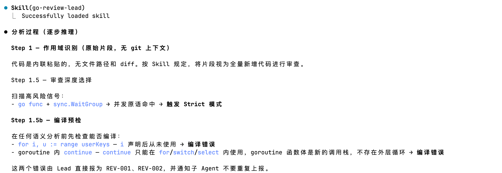
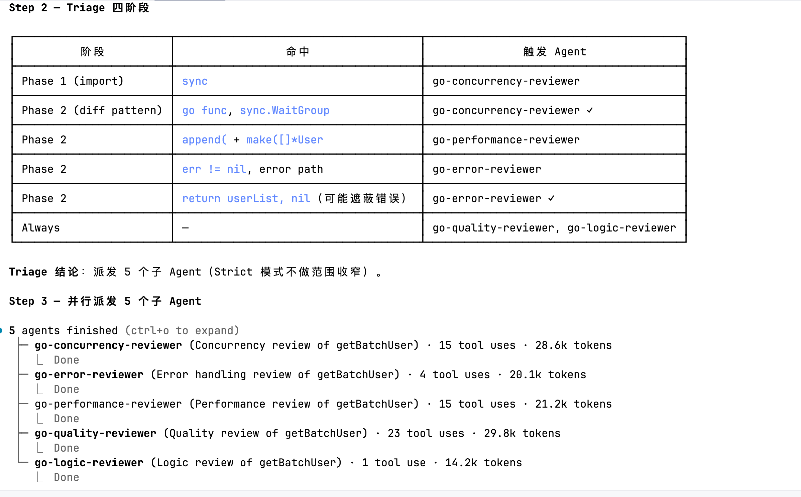
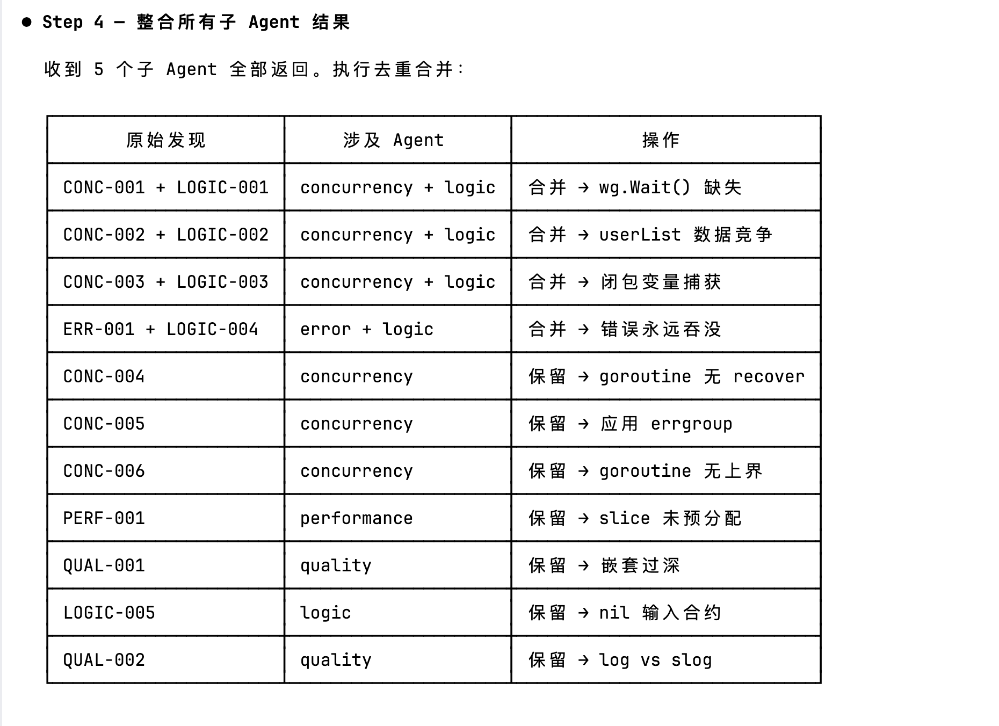
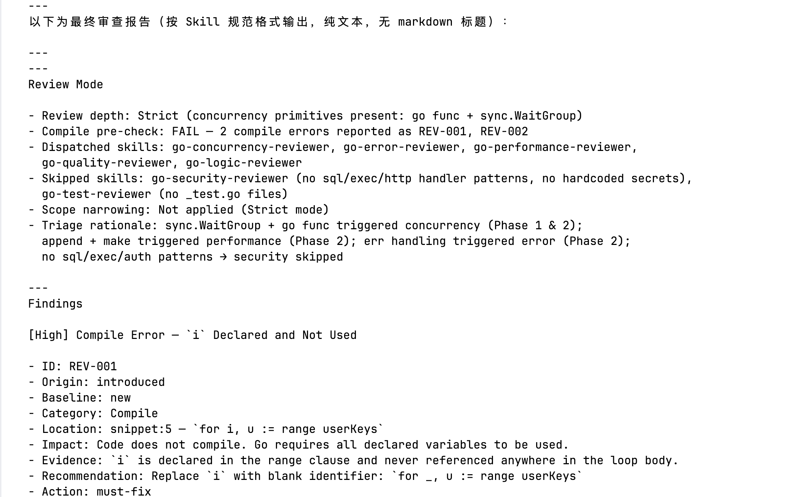

# Skill-Agent Collaboration Architecture: From a Single Skill to Multi-Agent Orchestration

> **Core conclusion**: When a skill carries too many task dimensions at once, high-priority tasks systematically crowd out lower-priority ones — even when the skill explicitly forbids skipping. This is a structural limitation of LLMs, not a prompting problem, and it cannot be resolved by stronger prompts alone. The solution is Skill-Agent collaboration: split the heavy skill into vertical skills that each focus on a single dimension, let each run in an independent agent with an isolated context, and pair the result with a Grep-Gated execution protocol that converts 75% of checklist items into rule-driven pre-scans, further reducing probabilistic omissions within each dimension.

## Table of Contents

- [17. Attention Dilution: An Architectural Problem, Not a Prompting Problem](#17-attention-dilution-an-architectural-problem-not-a-prompting-problem)
    - [17.1 The Pattern of Attention Dilution (Using a Code-Review Skill as the Example)](#171-the-pattern-of-attention-dilution-using-a-code-review-skill-as-the-example)
    - [17.2 Root Cause: Attention Competition in the Context Window](#172-root-cause-attention-competition-in-the-context-window)
    - [17.3 Why Multi-Agent Is the Right Direction](#173-why-multi-agent-is-the-right-direction)
    - [17.4 A Map of Five Orchestration Patterns: Each Has Its Strengths](#174-a-map-of-five-orchestration-patterns-each-has-its-strengths)
- [18. Skill-Agent Collaboration Architecture: Design, Implementation, and Validation](#18-skill-agent-collaboration-architecture-design-implementation-and-validation)
    - [18.1 Three Architecture Options Compared (Decision Matrix)](#181-three-architecture-options-compared-decision-matrix)
    - [18.2 Skill Splitting Guide](#182-skill-splitting-guide)
    - [18.3 Triage Mechanism (go-review-lead Skill in the Main Conversation)](#183-lead-agent-triage-mechanism)
    - [18.4 Grep-Gated Execution Protocol (Core Innovation)](#184-grep-gated-execution-protocol-core-innovation)
    - [18.5 Three-Round Iterative Validation](#185-three-round-iterative-validation)
    - [18.6 Complete Implementation Reference](#186-complete-implementation-reference)
    - [18.7 Frequently Asked Questions](#187-frequently-asked-questions)
    - [18.8 Degradation and Error Handling](#188-degradation-and-error-handling)
    - [18.9 Cost Model and Applicability](#189-cost-model-and-applicability)

---

<a id="17-attention-dilution-an-architectural-problem-not-a-prompting-problem"></a>
## 17. Attention Dilution: An Architectural Problem, Not a Prompting Problem

<a id="171-the-pattern-of-attention-dilution-using-a-code-review-skill-as-the-example"></a>
### 17.1 The Pattern of Attention Dilution (Using a Code-Review Skill as the Example)

When a single skill handles multiple dimensions simultaneously, high-priority tasks naturally capture the model's attention and cause systematic omissions of lower-priority ones. This is not a sporadic mistake — it is a reproducible structural failure, and code review scenarios illustrate it especially clearly.

Take the following Go code submitted to the `go-code-reviewer` skill:

```go
func getBatchUser(ctx context.Context, userKeys []*UserKey) ([]*User, error) {
    userList := make([]*User, 0)  // ← no capacity pre-allocation

    var wg sync.WaitGroup
    for i, u := range userKeys {
        if u == nil { continue }
        wg.Add(1)
        go func() {
            defer wg.Done()
            user, err := redis.GetGuest(ctx, u.Id)
            if err != nil {
                log.WarnContextf(ctx, "no found guest user: %v", u)
                continue  // ← continue inside goroutine, compile error
            }
            userList = append(userList, user)  // ← data race
        }()
    }
    return userList, nil  // ← missing wg.Wait()
}
```

The skill found 4 High-severity concurrent defects (compile error, data race, goroutine leak, loop-variable capture), **but missed one Medium-severity performance issue**:

```go
// Actual code (wrong)
userList := make([]*User, 0)

// Should be (known upper bound len(userKeys) → pre-allocate capacity)
userList := make([]*User, 0, len(userKeys))
```

This perfectly matches the "Slice Pre-allocation" item in the skill's Performance checklist. The skill also states explicitly:

> Execute ALL checklist categories regardless of how many High findings have already been identified

Yet the model still missed it. When the omission was pointed out, the model immediately acknowledged it:

> "After 4 High-severity concurrent defects consumed my attention, I was not careful enough walking through the Performance checklist and mistakenly categorized this as 'a minor issue that can be ignored' without formally reporting it."

**Key finding**: the problem is not that the model "doesn't know how" — it acknowledged the miss immediately when pointed out, proving it has the capability. The problem is that handling 5 review dimensions in a single call means High-severity findings naturally attract more attention, crowding out the cognitive budget available for other dimensions.

<a id="172-root-cause-attention-competition-in-the-context-window"></a>
### 17.2 Root Cause: Attention Competition in the Context Window

When a single agent loads a heavy skill, the context window holds all dimensional knowledge, all the code, and all discovered findings:

```
[Single Agent's Context Window]
┌─────────────────────────────────────────┐
│ go-code-reviewer SKILL.md (full)        │
│ ├── Security rules (SQL injection, ...) │
│ ├── Concurrency rules (races, leaks...) │
│ ├── Performance rules (pre-alloc, ...)  │  ← squeezed out
│ ├── Error-handling rules (wrap, nil...) │  ← squeezed out
│ └── Quality rules (naming, structure..) │  ← squeezed out
│                                         │
│ Findings found so far:                  │
│ ├── [High] REV-001 compile error ←───┐  │
│ ├── [High] REV-002 data race ←───────┤  │ attention here
│ ├── [High] REV-003 goroutine leak ←──┤  │
│ └── [High] REV-004 loop capture ←────┘  │
│                                         │
│ Performance checklist:                  │
│   Slice Pre-allocation → ??? (skipped)  │  ← insufficient attention
└─────────────────────────────────────────┘
```

Anthropic's internal research provides quantitative support for this phenomenon: in multi-agent research system benchmarks, **token usage explained 80% of performance variance**. The core reason is that each agent executes in a clean context window with higher token efficiency — direct evidence that context contamination ("context rot") degrades single-agent performance.

**This is not a prompting issue; it is an architectural issue.** Mitigations already tried:

| Mitigation | Effect | Limitation |
|------------|--------|------------|
| Emphasize "checklist cannot be skipped" in the skill | Partially effective | The rule itself competes for attention in the same context |
| Write to memory: "High findings must not cause skipping" | Helps next time | Does not fundamentally solve multi-dimension attention competition in a single context |
| Add stronger mandatory language to checklist | Limited improvement | LLM attention allocation is probabilistic; instructions alone cannot stabilize coverage |

These measures can reduce execution-omission probability from high to medium, but cannot eliminate it. The Iteration chapter (§15–16) has already recorded this ceiling: the final fix rate at the rule level is about 67%, with a persistent residual. This chapter provides the architectural solution.

<a id="173-why-multi-agent-is-the-right-direction"></a>
### 17.3 Why Multi-Agent Is the Right Direction

#### 17.3.1 Precise Definition of Multi-Agent and Its Four Mechanisms

A Multi-Agent architecture means multiple AI agents collaborate to complete a complex task under clear role assignments and cooperation protocols. **Each agent has its own context window, a dedicated toolset, and well-defined responsibilities.**

The evolution mirrors the journey from monolith to microservices in software engineering:

| Software Evolution | AI Agent Evolution |
|--------------------|-------------------|
| Monolith codebase too large to maintain | Single agent context window accumulates too much, performance degrades |
| Single-point failure affects the whole system | One dimension's failure contaminates the entire review chain |
| Cannot scale modules independently | Cannot choose the optimal model for different tasks |
| Responsibility boundaries blurry | Agent role confusion degrades output quality |

Just as large monolithic applications eventually need to be split into microservices, a monolithic agent needs to be split into specialized agents when the task is complex enough.

Four advantages of Multi-Agent for Go code review:

| Advantage | Mechanism | Meaning for This Scenario |
|-----------|-----------|---------------------------|
| **Focused context window** | Each sub-agent runs in a fresh, clean context, uncontaminated by other dimensions' findings | Concurrency review finding 4 High issues does not affect Performance review's sensitivity to `make([]*User, 0)` |
| **Deep specialization** | Each agent's system prompt focuses on a single domain, with a minimal toolset | Security agent sees only security defects; Performance agent sees only performance issues — no need to juggle others |
| **Multi-perspective quality assurance** | Multiple agents evaluate independently, unaware of each other's findings | Concurrency, error, and performance reviews each reach independent conclusions, cross-validating each other |
| **Flexible model assignment** | Lead uses a strong model for triage and aggregation; workers use faster models for individual reviews | Lead agent handles triage + deduplication; workers use Haiku/Sonnet to control cost |

The first advantage directly addresses the core problem in this document: when a single context window simultaneously holds multiple High-severity findings, the model's coverage of lower-priority checklist items degrades systematically. This structural flaw is hard to fix with prompts — Multi-Agent resolves it by running each dimension in an independent context, significantly reducing cross-dimension attention competition.

#### 17.3.2 Empirical Data: Anthropic + AgentCoder

**Anthropic Multi-Agent Research System Test** (source: Anthropic Engineering Blog, 2025):
- A Multi-Agent system with Claude Opus 4 (Lead) + Claude Sonnet 4 (Workers) outperformed **single-agent Opus 4 by 90.2%** in internal research benchmarks
- Token usage explained **80% of the performance variance** — the key is not a stronger model, but that each agent completes a focused task in a clean context

**AgentCoder Academic Research** (source: arXiv:2312.13010):
- Multi-Agent code generation (Programmer + Test Designer + Test Executor) achieved **96.3% pass@1** on HumanEval; single-agent SOTA was 90.2%
- Used **fewer tokens** (56.9K vs 138.2K) to achieve **higher accuracy**, proving that specialized division of labor can improve both quality and efficiency simultaneously

These results reveal a counterintuitive conclusion: the advantage of Multi-Agent comes not from "using more compute," but from **letting each agent focus on a more specific task in a clean context**.

<a id="1733-architecture-over-model-reducing-dependency-on-top-tier-reasoning-models"></a>
#### 17.3.3 Architecture Over Model: Reducing Dependency on Top-Tier Reasoning Models

The empirical data in §17.3.2 points to a conclusion worth highlighting on its own: Multi-Agent architecture isn't just about "using cheaper models to do the same thing" — it's about **using cheaper models to do something better**.

| Configuration | Model | Review Quality (Baseline Case) | Missed Findings |
|---------------|-------|:-----------------------------:|:---------------:|
| Single Agent | Opus 4 | 4 High found, 1 Medium missed | 1 |
| Multi-Agent Orchestrator-Workers | Sonnet 4 Workers + Sonnet Lead | All 13/13 captured | 0 |

**Why can a cheaper model + better architecture outperform a stronger model + single agent?**

The root cause is a mismatch between task structure and model capability. Opus genuinely outperforms Sonnet on a single focused task — but when asked to simultaneously cover 5 independent dimensions in the same context, attention dilution systematically degrades its per-dimension performance. Sonnet, when responsible for only one dimension (e.g., concurrency issues only), operates near full focus with no cross-dimension attention competition.

Put differently: **for multi-dimensional tasks, Sonnet × N focused agents can outperform Opus × 1 generalist agent.**

**Cost trade-off:**

| Dimension | Single Opus Agent | Multi-Agent Sonnet Workers |
|-----------|:-----------------:|:--------------------------:|
| Per-call inference cost | High (Opus ~5–10× Sonnet pricing) | Low (each worker uses Sonnet/Haiku) |
| Total token consumption | Low (single call) | High (multiple parallel agents cumulate) |
| Overall cost | Medium | Medium (more tokens, lower per-token price — roughly comparable) |
| Review quality | Subject to attention dilution | More comprehensive, more stable |

Although parallel multi-agent execution accumulates more total tokens, each individual inference call uses a lower-cost model. The two effects offset each other — overall cost is often roughly comparable, while quality improves significantly.

**Core insight:** This changes the mental model for model selection. The old question was "which is the most powerful model I should use?" — the better question is now "can I restructure my task so each agent only needs to excel at one thing?" If yes, a mid-tier model with a well-designed architecture often outperforms a top-tier model with a naive architecture.

For scenarios suffering from attention dilution, this means: **you don't need to wait for the next-generation model to resolve missed findings — architecture refactoring is a more controllable, more predictable solution on the models you already have.**

<a id="174-a-map-of-five-orchestration-patterns-each-has-its-strengths"></a>
### 17.4 A Map of Five Orchestration Patterns: Each Has Its Strengths

After establishing Multi-Agent's advantages, the next question is: **which orchestration pattern should I choose?** This section systematically maps five foundational patterns to help skill designers find the best architecture for different tasks, not just for the code-review scenario.

Anthropic defines five foundational orchestration patterns, classified by when subtask decisions are made and how execution is structured:

| Pattern | Core Mechanism | Subtask Source | Execution Structure |
|---------|----------------|----------------|---------------------|
| **Prompt Chaining** | Steps pass linearly; A's output is B's input | Fixed linear sequence | Sequential |
| **Routing** | Classify input, route to one specialized handler | Fixed branches, pick one | Exclusive selection |
| **Parallelization** | Pre-fixed parallel paths run simultaneously, aggregate results | Fixed set, all execute | Parallel |
| **Orchestrator-Workers** | Orchestrator dynamically decides which workers are needed | Decided at runtime, on-demand | Dynamic parallel |
| **Evaluator-Optimizer** | Generate → evaluate → refine until quality threshold is met | Fixed two roles, iterative loop | Iterative |

---

#### Pattern 1: Prompt Chaining

**Core:** Step A's output feeds directly into step B, forming a linear pipeline. Each step builds on the previous one.

**When to use:** tasks with clear sequential dependencies; information flows one-way between steps; the output quality of each step directly affects the next.

**Typical backend scenario: API-driven code generation pipeline**

Starting from an OpenAPI spec, progressively generate the full code chain:

```
OpenAPI spec (input)
       │
       ↓
[Step 1: Interface Parsing Agent]
  Output: Go structs and interface type definitions
       │
       ↓
[Step 2: Code Generation Agent]
  Input: Step 1 structs  →  Output: handler + service skeleton
       │
       ↓
[Step 3: Test Generation Agent]
  Input: full code  →  Output: integration tests
       │
       ↓
Complete code + tests (output)
```

Each step depends on the previous step's output; handlers must reference already-defined structs, and tests must target known interface shapes. Similar scenarios include database migration assistance (analyze current schema → generate migration SQL → generate rollback SQL → generate change documentation), where there is a one-way dependency between steps.

**Assessment for code review:** ✗ Not applicable. Security/concurrency/performance review dimensions have no sequential dependency; A's output does not need to feed B.

---

#### Pattern 2: Routing

**Core:** classify the input, route it to the most suitable specialized handler. Each request travels **one** path; different input types follow completely different processing logic.

**When to use:** input types can be clearly classified; different types need completely different handling; each request needs only one type of processing.

**Typical backend scenario: multi-language code review routing**

Route to the corresponding language skill based on file extension — each request takes only one path:

```
Code file (input)
       │
       ↓
[Classifier: detect file type]
       │
       ├─ .go  → [Go Review Skill]
       ├─ .py  → [Python Review Skill]
       ├─ .ts  → [TypeScript Review Skill]
       └─ .sql → [SQL Review Skill]
```

Another typical scenario: **SQL operation type routing** — route SQL statements by type, since read optimization and write safety are completely different problem domains:

```
SQL statement
  ├─ SELECT        → [Read Performance Agent]
  ├─ INSERT/UPDATE → [Write Safety Agent]
  └─ DDL           → [Migration Safety Agent]
```

**Assessment for code review:** ✗ Not applicable. A single Go code review needs to cover security, concurrency, performance, and other dimensions simultaneously — not select just one.

---

#### Pattern 3: Parallelization

**Core:** split the task into **pre-fixed** subtasks, run all in parallel, then aggregate results. The subtask set is determined at design time; every input executes the same N paths.

**When to use:** subtasks are independent of each other; all of these checks must run regardless of input content; total completion time is bounded by the slowest subtask.

**Typical backend scenario 1: multi-format documentation generation**

Generate multiple output formats simultaneously from the same service interface — the three paths are fully independent and always run together regardless of what the interface definition contains:

```
Service interface definition (input)
       │
       ├─→ [Chinese README Agent]  → README.zh-CN.md
       ├─→ [English README Agent]  → README.md
       └─→ [OpenAPI Agent]         → openapi.yaml
```

**Typical backend scenario 2: fixed compliance scan pipeline**

All three checks must be run on every PR merge, no exceptions — these checks are independent of code content:

```
PR code (input)
       │
       ├─→ [License Compliance Agent]   → third-party license issues
       ├─→ [Dependency Security Agent]  → CVE vulnerability list
       └─→ [Coding Standards Agent]     → standards violations
```

This is the most natural fit for Parallelization: a fixed set of checks that must always run completely, independent of input content.

**Key distinction between Parallelization and Orchestrator-Workers:**

```
Parallelization:
  Code → [Fixed dispatch: Security + Concurrency + Performance + ...] → Aggregate
  Subtasks are fixed at design time; every review runs all N paths

Orchestrator-Workers:
  Code → [Lead Agent analyzes diff] → Dynamic decision → Dispatch K paths (K ≤ N) → Aggregate
  Subtasks are decided at runtime based on code content
```

**Assessment for code review:** △ Close but not optimal. If the code only renames a variable, Parallelization would still launch all 8 agents, costing ~$0.16; Orchestrator-Workers would need only 2 agents, ~$0.02.

---

#### Pattern 4: Orchestrator-Workers

**Core:** a central orchestrator analyzes the input and **dynamically decides at runtime** which workers are needed and their task boundaries, then schedules them in parallel and aggregates the results. The subtask list is not fixed at design time; the orchestrator decides based on the specific input.

**When to use:** the subtasks needed depend on the input content and cannot be known at design time; different inputs need different combinations of processing; the work requires a "understands the big picture, assigns tasks" coordinator.

**Typical backend scenario 1: content-driven code review** (this document's case — see §18)

Dispatch review agents based on code content:

```
Code diff (input)
       │
       ↓
[Lead Agent triage]
       │
       ├─ contains go func / sync      → dispatch Concurrency Agent
       ├─ contains make([], 0) + append → dispatch Performance Agent
       ├─ contains _test.go changes     → dispatch Test Agent
       ├─ always dispatch               → Quality + Logic Agent
       └─ no SQL/HTTP patterns          → skip Security Agent (log reason)
```

5 lines of variable renames: 2 agents. A PR introducing concurrency and performance issues: 5 agents — dynamic allocation, costs only what is needed.

**Typical backend scenario 2: adaptive bug-fix pipeline**

Lead Agent analyzes the bug's impact surface and dynamically decides which fix actions are needed — the fix scope depends entirely on the bug's nature:

```
Bug report (input)
       │
       ↓
[Lead Agent analyzes impact scope]
       │
       ├─ affects database operations → dispatch DB fix + migration Agent
       ├─ affects API interface       → dispatch interface fix + contract update Agent
       ├─ tests need supplementing    → dispatch test completion Agent
       └─ cross-module propagation   → additionally dispatch doc update + notification Agent
```

**Assessment for code review:** ✅ **Optimal choice.** "Which agents are needed depends on the code being reviewed" — this is exactly Anthropic's definition of the Orchestrator-Workers applicable scenario: **"cannot predict which subtasks will be needed in advance; the orchestrator must decide dynamically based on input."**

---

#### Pattern 5: Evaluator-Optimizer

**Core:** a generate → evaluate → refine iterative loop, continuing until a quality threshold is met or an iteration limit is reached. The evaluation result determines whether to continue iterating and how to improve.

**When to use:** initial output quality is unstable and needs iterative refinement; there are actionable quality standards (can judge "pass/fail"); iterative improvement has positive returns and converges within a few rounds.

**Typical backend scenario 1: SQL query auto-optimization**

Execution plan quality can be judged mechanically (`Index Scan` vs `Seq Scan`), making this an ideal Evaluator-Optimizer scenario:

```
Business query requirement (input)
       │
       ↓
[Generation Agent] → initial SQL
       │
       ↓
[Evaluation Agent] ← run EXPLAIN, check execution plan
       │
       ├─ Pass (Index Scan, row estimate ≤ threshold) → output SQL
       └─ Fail (Seq Scan or row count too high)
              │
              ↓
       [Optimization Agent] → rewrite SQL or suggest new index
              │
              └─→ loop (limit 3 rounds)
```

**Typical backend scenario 2: test-coverage auto-completion**

Use actual test run results as the evaluation basis, iterating until coverage meets the target:

```
Function to be tested (input)
       │
       ↓
[Generation Agent] → initial test code
       │
       ↓
[Evaluation Agent] ← run go test -race -cover
       │
       ├─ Pass (coverage ≥ 80%, no data race) → output test code
       └─ Fail (mark uncovered code paths)
              │
              ↓
       [Completion Agent] → add boundary tests for uncovered paths
              │
              └─→ loop (limit 2 rounds)
```

**Typical backend scenario 3: API design quality iteration**

Use checklist pass rate as the evaluation standard, driving iterative refinement of interface definitions:

```
Functional requirement (input)
       │
       ↓
[Design Agent] → initial interface definition
       │
       ↓
[Evaluation Agent] ← REST standards checklist + security checklist + backward-compatibility check
       │
       ├─ Pass (all checklist items ✅) → output interface definition
       └─ Fail (list specific violations)
              │
              ↓
       [Improvement Agent] → revise interface definition
              │
              └─→ loop (limit 2 rounds)
```

**Key Evaluator-Optimizer trade-off:** every iteration adds latency and token cost. This is appropriate for scenarios where output quality has a significant business impact and there is an actionable evaluation standard. If the evaluation standard is vague (such as "code readability"), it easily falls into an ineffective loop.

**Assessment for code review:** ✗ Not applicable. Code review is a diagnostic task and should honestly reflect the current state of the code — "improving the review report" and "fixing the reviewed code" are different tasks and should not be confused in an Evaluator-Optimizer loop.

---

#### Selection Decision Tree

```
Facing a new Multi-Agent task — how do I choose?

Do steps have sequential dependencies (A's output is B's input)?
  Yes → Prompt Chaining
  No ↓

Can input be classified, and does each request need only one type of processing?
  Yes → Routing
  No ↓

Is iterative refinement needed, with an actionable quality threshold?
  Yes → Evaluator-Optimizer
  No ↓

Regardless of input content, always execute the same fixed set of paths?
  Yes → Parallelization
  No → Orchestrator-Workers (subtasks depend on input content, decided at runtime)
```

**Final selection for Go code review:** which agents to dispatch depends on the code being reviewed (concurrency patterns need a Concurrency Agent, `make([], 0)` needs a Performance Agent). This is a textbook "subtasks decided at runtime" scenario, and the decision tree points to Orchestrator-Workers. §18 shows the full implementation and validation process.

---

<a id="18-skill-agent-collaboration-architecture-design-implementation-and-validation"></a>
## 18. Skill-Agent Collaboration Architecture: Design, Implementation, and Validation

> This chapter uses the `go-code-reviewer` → 7-agent orchestration system as the running case to demonstrate the full implementation path for an Orchestrator-Workers architecture. The design principles covered (vertical splitting, main conversation handles orchestration, on-demand triage, Grep-Gated protocol) are not specific to code review — they apply to any heavy skill that suffers from attention dilution.

<a id="181-three-architecture-options-compared-decision-matrix"></a>
### 18.1 Three Architecture Options Compared (Decision Matrix)

| Architecture | Characteristics | Known Problems | Recommended |
|--------------|-----------------|----------------|:-----------:|
| **A: Single Skill** | 1 agent loads all review knowledge, completes all dimensions in one call | Attention dilution; High findings systematically suppress other dimensions; proven misses | Basic scenarios |
| **B: Multi-Agent without Skills** | 7 vertical agents, prompt-only, no skills loaded; main conversation handles orchestration | Clean context, but no domain review rules; relies entirely on AI's general knowledge; may miss project-specific rules | Not recommended |
| **C: Multi-Agent + Vertical Skills** | Main conversation loads go-review-lead Skill for triage and aggregation; 7 vertical agents each load their domain skill | Slightly higher design and maintenance cost | ✅ Recommended |

Core principles of Architecture C:

**Principle 1: Each agent loads exactly one dimension's skill.** A Performance Agent's context primarily contains only performance-related knowledge and the code to be reviewed, with no other dimensions' rules and no findings from other agents. This significantly raises the probability that the model focuses its attention on the Performance checklist.

**Principle 2: The main conversation (orchestrator role) does not review code.** After loading the go-review-lead Skill, the main conversation acts as the orchestrator — it only does triage and aggregation, loads no vertical review skills, and does not directly analyze code logic. If the orchestrator also reviewed, its own findings would bias its aggregation of the other agents' results, recreating the same problem as the heavy skill.

**Principle 3: Vertical agents load knowledge on demand through Skill tools.** Agent definition files are lightweight (a few dozen lines of prompts). Review knowledge is stored in standalone skill files that agents load at runtime via the `Skill()` tool. No content is duplicated, and skill files can be reused across agents.

**Principle 4 (platform constraint + engineering decision): Orchestration logic must be encapsulated as a Skill and executed in the main conversation.** This conclusion rests on two layers of reasoning — without either layer, the answer to "why a Skill specifically" is incomplete.

**Layer 1: Why can orchestration not run as a subagent (i.e., be configured as an agent definition in `.claude/agents/`)?**
Claude Code explicitly states that subagents cannot spawn other subagents ("Subagents cannot spawn other subagents"). If go-review-lead were configured as an agent definition file, it would run as a subagent when invoked, and its Agent tool calls for parallel dispatch would be silently ignored — the 7 vertical agents would degrade to serial execution, or not be dispatched at all.

**Layer 2: Given that the orchestrator must run in the main conversation, why can it not simply be an inline prompt — why must it be packaged as a Skill?**
This is the more important question to answer. There are two reasons:

1. **Unacceptable complexity**: The orchestration process is a mixed pipeline-and-parallel-exploration pattern — scope identification → review depth selection → compile pre-check → four-phase triage → dynamic dispatch to N vertical agents in parallel → deduplication and consolidation. Writing this as an inline prompt would produce something far too long and fragile to maintain as a one-off.

2. **No reusability**: Every code review session would require re-supplying this complex prompt from scratch. This is a standardized pipeline that should be encapsulated, not re-written each time.

Complete reasoning chain:

```
Platform constraint: subagents cannot spawn subagents
  → orchestration must run in the main conversation
  → Option A: use an inline prompt for each review session?
      → No: pipeline too complex + not reusable
  → Option B: encapsulate as a Skill, invoked by the main conversation
      → Yes: complexity is contained + standardized + reusable
      → Skill is the only appropriate vehicle
```

**A deeper observation**: encapsulating the orchestration logic as a Skill is not merely a pragmatic engineering decision — it directly instantiates the architecture pattern this chapter describes, and does so simultaneously at two levels:

| Level | Role | Pattern |
|-------|------|---------|
| **Macro** | Main conversation invokes orchestration Skill → Skill dispatches 7 subagents in parallel → Skill deduplicates and consolidates → main conversation presents result | Skill orchestrates Agents |
| **Micro** | Each subagent loads its own specialized vertical review Skill to perform its work | Agent depends on Skill |

Both levels run the same Skill-Agent collaboration pattern; the architecture is self-consistent from top to bottom: **orchestration uses a Skill, execution uses a Skill, and Agents are what connect them**. This is not coincidence — it is the Skill-Agent collaboration idea applied consistently throughout.

Full architecture overview (main conversation Skill orchestration + 7 vertical agents):

```
                      PR Diff / Code Snippet
                             │
                             ↓
              [Main conversation + go-review-lead Skill]
                   Responsibilities: triage + dispatch + aggregation
                   Loads go-review-lead Skill
                   Does not load vertical review skills
                   Does not directly review code
                             │
                     Phases 1-4: Triage
                     grep + pattern matching, determines which dimensions are involved
                             │
    ┌────────┬────────┬───────┼───────┬────────┬────────┐
    ↓        ↓        ↓       ↓       ↓        ↓        ↓
[Security][Concurr][Perf] [Error] [Quality] [Test] [Logic]
  Agent    Agent   Agent  Agent   Agent    Agent   Agent
    │        │       │      │       │        │       │
  Load     Load    Load   Load    Load     Load    Load
 security concurr  perf  error  quality   test   logic
  Skill    Skill   Skill  Skill   Skill    Skill   Skill
    │        │       │      │       │        │       │
 Review   Review  Review Review  Review   Review  Review
 independently in each own clean context
    └────────┴────────┴───────┴───────┴────────┴────────┘
                             │
                             ↓
                     Main conversation aggregates
                   Merge findings + deduplicate + sort by severity
                             │
                             ↓
                         Final report
```

<a id="182-skill-splitting-guide"></a>
### 18.2 Skill Splitting Guide (Using `go-code-reviewer` as the Example)

**When to split:**

| Signal | Should You Split? |
|--------|:-----------------:|
| Skill checklist covers 3+ independent dimensions | Yes — dimensions compete for attention |
| A single review regularly produces 5+ High findings | Yes — more High findings means more other dimensions get suppressed |
| Users often point out "this should have been found but wasn't" | Yes — classic attention-dilution symptom |
| Skill covers only 1 dimension and checklist has fewer than 15 items | No — context burden is manageable; single agent is sufficient |

**Directory structure** (using `go-code-reviewer` as the example):

```
skills/
├── go-security-review/SKILL.md      # SQL injection, XSS, key leakage, permissions
├── go-concurrency-review/SKILL.md   # races, goroutine leaks, deadlocks, WaitGroup
│   └── references/go-concurrency-patterns.md
├── go-performance-review/SKILL.md   # pre-allocation, N+1, indexes, memory
│   └── references/go-performance-patterns.md
├── go-error-review/SKILL.md         # error wrapping, resource close, panic handling
├── go-quality-review/SKILL.md       # naming, structure, lint rules, comment style
├── go-test-review/SKILL.md          # coverage, assertion quality, test isolation
└── go-logic-review/SKILL.md         # business logic, boundaries, nil, error propagation

# go-review-lead runs as a Skill in the main conversation — NOT in .claude/agents/
# The main conversation loads it via: skills/go-review-lead/SKILL.md

.claude/agents/                      # contains only the 7 vertical worker agents
├── go-security-reviewer.md          # loads go-security-review
├── go-concurrency-reviewer.md       # loads go-concurrency-review
├── go-performance-reviewer.md       # loads go-performance-review
├── go-error-reviewer.md             # loads go-error-review
├── go-quality-reviewer.md           # loads go-quality-review
├── go-test-reviewer.md              # loads go-test-review
└── go-logic-reviewer.md             # loads go-logic-review
```

**Checklist cap principle:** each vertical skill's checklist must not exceed 15 items. If it does, the dimension can be split further. This cap is not arbitrary — a checklist of 15 items or fewer stays within the coverage range of the model's attention in an isolated context. Exceeding it reintroduces within-dimension dilution risk.

<a id="183-lead-agent-triage-mechanism"></a>
### 18.3 Triage Mechanism (go-review-lead Skill Running in the Main Conversation)

#### Two-Level Triage

Triage happens at two levels with dramatically different cost profiles:

**Level 1: File-type triage** (no LLM needed, grep suffices)

```bash
# .go files changed?      → proceed to Level 2
# _test.go files changed? → dispatch go-test-reviewer
# go.mod changed?         → dispatch go-security-reviewer (dependency review)
# .sql / migration?       → dispatch go-security-reviewer
```

**Level 2: Content triage** (fast Haiku scan of diff, ~$0.001 per call)

```
diff contains go func / channel / sync  → Concurrency Agent
diff contains make([] + zero capacity   → Performance Agent
diff contains sql.Rows / tx.Begin       → Error + Security + Performance Agent
function name includes Batch / Multi / GetAll → Performance Agent
```

Level 1 consumes no tokens. Combined, the two levels cost negligibly per triage.

#### Four-Phase Triage Logic (Phases 1–4)

| Phase | Scan Target | Typical Trigger Rules |
|-------|-------------|----------------------|
| Phase 1: Import scan | Import blocks in all changed files | `"sync"` → Concurrency; `"database/sql"` → Security + Error + Performance |
| Phase 2: Diff pattern scan | Only added/modified lines | `make(\[\]` zero capacity + `append(` co-occurring → Performance; `go func` → Concurrency |
| Phase 3: File-path heuristic | Paths and function names of changed files | `auth/`, `handler/` → Security; function name contains batch semantics → Performance |
| Phase 4: Change-scope assessment | Overall diff structure | New `.go` file → force dispatch Error; `go.mod` change → re-run Phase 1 on new dependencies |

**No-catch-all dispatch principle:** if an agent is not triggered by any phase, it is skipped and the reason is recorded explicitly — not launched indiscriminately. This is the most critical value of the triage mechanism.

#### Cost Comparison

| Approach | Simple Style PR | Complex Concurrency PR | Full-scope Refactor |
|----------|:--------------:|:---------------------:|:------------------:|
| Full 7 agents (no triage) | ~$0.16 | ~$0.16 | ~$0.16 |
| Triage + on-demand dispatch | ~$0.02 | ~$0.07 | ~$0.10 |
| Original single skill | ~$0.03 | ~$0.03 (but misses) | ~$0.03 (but misses) |

On-demand dispatch saves about 80% of cost on simple PRs; on complex PRs the cost is comparable to full launch, but review quality is significantly better than the single-skill approach.

> Note: the above costs are approximate estimates based on Claude Haiku 4.5 / Sonnet 4.6 official pricing as of March 2026. Actual costs also depend on code volume (token count); these figures are order-of-magnitude references only.

<a id="184-grep-gated-execution-protocol-core-innovation"></a>
### 18.4 Grep-Gated Execution Protocol (Core Innovation)

#### Rethinking the Fundamental Problem

The first-round Multi-Agent architecture (§18.5 Round 2) exposed a fundamental design mistake: **it treated the model as a human code reviewer**. Human reviewers read the checklist, then use their "eyes" to scan the code, relying on attention and experience to find problems. The model was being asked to do exactly the same thing — use "attention" to scan the checklist, then search for matches in the code. The problem with this approach is that a model's attention is probabilistic; grep's detection of explicit patterns is closer to rule-driven mechanical scanning.

**The model is not a human. It has tools it can use.**

Core solution: **tool-assisted detection + model judgment**. For checklist items with clear syntactic features, have the model first do a mechanical grep scan, then do semantic confirmation on HIT results. Only genuinely reasoning-heavy semantic items get full model analysis.

#### Execution Flow (Step by Step)

For each sub-agent, the execution flow becomes:

```
1. Load the corresponding domain skill via the Skill tool (checklist + rules + grep patterns)
2. Identify target files (or write bare code snippets to $TMPDIR/review_snippet.go)
3. For all grep-gated checklist items, run grep with the patterns from the skill
4. grep HIT  → model performs semantic confirmation (true positive vs false positive)
5. grep MISS → automatically mark NOT FOUND, skip semantic analysis, do not report to the main conversation
6. Items without grep patterns (pure semantic items) → full model reasoning
7. Report only FOUND items
8. Include in Execution Status an audit line: Grep pre-scan: X/Y items hit, Z confirmed
```

When the main conversation aggregates sub-agent reports, it verifies coverage using the audit lines rather than blindly trusting "no report = no problem."

#### Coverage Statistics

7 skills, 86 checklist items, of which 65 (75%) are grep-able:

| Skill | Total Items | Grep-able | Semantic Only |
|-------|:-----------:|:---------:|:-------------:|
| go-concurrency-review | 14 | 13 | 1 |
| go-performance-review | 12 | 10 | 2 |
| go-error-review | 12 | 12 | 0 |
| go-security-review | 16 | 14 | 2 |
| go-quality-review | 12 | 8 | 4 |
| go-test-review | 10 | 8 | 2 |
| go-logic-review | 10 | 0 | 10 |
| **Total** | **86** | **65 (75%)** | **21 (25%)** |

In the current design, 75% of checklist items have been converted to rule-driven pre-screening. The model's attention can focus more on the remaining 25% of semantic items.

#### Wide-Net Design Principle

The Grep-Gated protocol uses a **wide-net** strategy: **prefer false-positive HITs over false-negative MISSes**.

- The pattern `go\s+func` triggers 6 concurrency review items simultaneously, producing many HITs
- False positives are filtered by the model in the semantic confirmation phase, at acceptable cost
- A MISS skips semantic analysis entirely — once missed, there is no second chance to recover

This asymmetry means patterns should err on the side of broader matches: the cost of a missed defect (real bug undetected) far outweighs the cost of a false trigger (one extra semantic confirmation).

#### Composite Patterns for Detecting Missing Protections

For "should have A but doesn't have B" absence-type problems, use **composite patterns**:

```
# CONC-14: Unbounded goroutine creation (concurrency without rate limiting)
grep pattern: go\s+func
AND NOT: SetLimit|semaphore|maxConcurrency|worker.*pool

# PERF-01: Slice without pre-allocation (make with no capacity argument)
grep pattern: make\(\[\][^]]+,\s*0\)   → detect zero capacity
AND NOT: third argument present
```

Composite patterns make "missing protection" class problems mechanically detectable by grep rather than relying on the model's attention to notice something that "isn't there" — precisely the scenario where attention most easily lapses.

#### Special Handling for `go-logic-review`

`go-logic-review` covers business logic, boundary conditions, contract violations, nil safety, and similar issues that lack stable syntactic features and cannot be pre-filtered by grep. All 10 of this skill's checklist items are pure semantic analysis, so it uses a dedicated execution template:

```markdown
## Execution Order

After invoking the skill:
1. Identify target files (from dispatch prompt)
2. All checklist items are semantic-only — no grep pre-scan applicable
3. Apply full model reasoning to each item
4. Report FOUND items only
5. Include: `Semantic-only skill: 10/10 items evaluated`
```

This is the protocol's natural boundary: grep only makes sense for problems with syntactic features. Forcing grep-ification of semantic items would produce large numbers of meaningless MISSes and undermine confidence in coverage.

<a id="185-three-round-iterative-validation"></a>
### 18.5 Three-Round Iterative Validation

The same `getBatchUser` code from §17.1 was used for three complete validation rounds, each improving on the previous architecture.

#### Three-Round Comparison at a Glance

| Metric | Round 1: Single Skill | Round 2: Multi-Agent v1 | Round 3: Multi-Agent + Grep-Gated |
|--------|:---------------------:|:----------------------:|:--------------------------------:|
| Architecture | 1 agent + heavy skill | 8 agents misconfigured (Lead as agent, parallel dispatch blocked) | 7 worker agents + main conversation Skill orchestration + Grep-Gated |
| Agents dispatched | 1 | 4 (performance skipped) | 5 (including performance) |
| High findings | 4 | 7 | 7 |
| Medium findings | 1 (1 missed) | 2 (4+ missed) | 6 |
| Slice pre-allocation | ❌ Not found | ❌ Not found (performance not triaged) | ✅ REV-009 formally reported |
| Unbounded goroutines | ❌ Residual Risk only | ⚠️ Sometimes missed | ✅ REV-008 formally reported |
| Total findings captured | 8/9 (1 missed) | Unstable | **13/13** |

#### Round 1: Single Skill Failure

The single-skill call found 4 High concurrent defects, but missed Slice Pre-allocation. The model later acknowledged that the Performance checklist's attention had been crowded out by High findings. This is the starting point for the refactoring.

#### Round 2: Multi-Agent v1 New Problems

After the initial 1 skill → Multi-Agent refactor (at this stage, the Lead was incorrectly configured as an agent definition, which blocked parallel dispatch due to the platform constraint that subagents cannot spawn subagents), validation revealed two additional problems:

**Problem 1: Triage blind spot.** `go-review-lead`'s Phase 2 original trigger condition only fired on `make` calls **with** a capacity argument — but `make([]*User, 0)` was the case **without** a capacity argument. The rule matched in reverse, so `go-performance-reviewer` was skipped entirely. Submitting the code as a bare snippet also invalidated Phase 3's file-path heuristic.

**Problem 2: Within-dimension attention dilution.** Even when `go-concurrency-reviewer` was correctly triaged and dispatched, when the context contained multiple High-severity compile errors and data races, "unbounded goroutine creation" (a Medium-severity issue) was still deprioritized by the model and ended up only in Residual Risk rather than as a formal finding.

The architecture had already isolated different review dimensions into separate contexts, **but within a single agent's context, multiple High-severity findings still suppressed Medium-severity items**. Attention dilution persisted inside vertical dimensions. The first-round architecture refactoring's aggregated report (relevant excerpt):

```
- Skipped skills: go-performance-reviewer (no hot-path loops or DB patterns)
                  ← triage blind spot caused the skip

Residual Risk:
2. Unbounded goroutine spawning: ... Not flagged as a finding since expected
   batch size is unknown ...    ← not formally reported, buried in Residual Risk

Summary: 7 High / 2 Medium / 1 Low.
```

#### Round 3: Multi-Agent + Grep-Gated Validation Passes

To fix the triage blind spot, Phase 2 trigger conditions were updated to detect zero-capacity `make` as well, and Phase 3 added batch-semantics function name heuristics (`getBatchUser` hits directly). To fix within-dimension attention dilution, the Grep-Gated execution protocol was introduced.

Validation result: **all 13 expected findings were captured in this baseline case, with no new omissions observed.**

Complete trajectory of `slice pre-allocation`:

| Round | Status | Reason |
|-------|--------|--------|
| Round 1 (single skill) | Not found | Performance checklist attention crowded out by 4 High findings |
| Round 2 (Multi-Agent v1) | Not found → Residual Risk | Performance agent not triaged; within-dimension attention competition remained |
| Round 3 (Multi-Agent + Grep-Gated) | **REV-009 [Medium] formally reported** | `make([]*User, 0)` mechanically hit by grep pattern; cannot be suppressed by attention dilution |

Final report (excerpt):

```
- Dispatched: go-concurrency-reviewer, go-performance-reviewer,
              go-error-reviewer, go-quality-reviewer, go-logic-reviewer
- Triage: make([]*User, 0) + append( + getBatchUser batch semantics hit Phase 2+3

[Medium] Missing Slice Pre-allocation — Repeated Reallocation in Batch Hot Path
- ID: REV-009 (original: PERF-001)
- Evidence: userList := make([]*User, 0) — zero capacity, no second argument.
  Grep hit: make([]*User, 0) at L10. Function name getBatchUser signals batch hot path.
- Recommendation: userList := make([]*User, 0, len(userKeys))

[Medium] Unbounded Goroutine Spawning — Resource Exhaustion Under Large Batches
- ID: REV-008 (original: CONC-005)
- Evidence: goroutine count scales linearly. No SetLimit, semaphore, or worker pool
  present. Grep: go\s+func HIT AND NOT SetLimit|semaphore MISS.

Summary: 7 High / 6 Medium — 13/13 expected findings captured.
```

The improvement loop is now complete: single-skill attention dilution → Multi-Agent architecture refactor → triage blind-spot fix → Grep-Gated protocol introduction → 13/13 full capture.

<a id="186-complete-implementation-reference"></a>
### 18.6 Complete Implementation Reference

The Multi-Agent architecture described in this chapter is published as runnable files in this repository and can be deployed directly to a Claude Code environment:

| Content | Path | Description |
|---------|------|-------------|
| Orchestrator Skill | [`skills/go-review-lead/SKILL.md`](../skills/go-review-lead/SKILL.md) | Main conversation orchestration logic: triage rules, aggregation format, report spec (runs as a Skill — not an agent definition) |
| 7 vertical review Skills | `skills/go-{concurrency,performance,error,security,quality,test,logic}-review/SKILL.md` | Per-dimension checklists, Grep-Gated patterns, and output format |
| 7 Agent definition files | [`outputexample/go-review-lead/agents/`](../outputexample/go-review-lead/agents/) | Drop-in vertical worker agent files for `.claude/agents/` — does not include go-review-lead |
| Deployment guide | [`outputexample/go-review-lead/README.md`](../outputexample/go-review-lead/README.md) | Installation steps, prerequisites, and usage examples |














<a id="187-frequently-asked-questions"></a>
### 18.7 Frequently Asked Questions

**Q: How should cross-dimension issues (e.g., unbounded goroutines = concurrency + performance) be handled?**

Allow two agents to independently report the same issue from their respective angles. The main conversation deduplicates during aggregation, taking the higher severity and merging the evidence. Cross-reports are better than omissions — the cost of deduplication is far less than the cost of missing a real bug. `REV-008` (unbounded goroutines) was formally reported by the Concurrency Agent from a concurrency perspective, but also has performance semantics; the two are merged into one finding, with the higher severity (Medium) taken.

**Q: Should all heavy skills be split?**

No. The criteria: covers 3+ independent dimensions, regularly produces 5+ High findings in a single review, or users repeatedly report misses. If a skill covers only one dimension and has fewer than 15 checklist items, the context burden is manageable, a single agent is sufficient, and the design and maintenance cost of Multi-Agent is not justified.

**Q: What model should the main conversation use when running the go-review-lead Skill?**

Sonnet is sufficient. Triage (pattern matching) and aggregation (merge and sort) do not require deep reasoning. Using Opus here is over-configuration. Use Sonnet for the vertical review agents; consider Opus for especially complex architectural-level reviews.

**Q: Can Grep-Gated's grep MISSes lead to real-problem omissions?**

Yes — this is a known trade-off in the protocol. A grep MISS means the pattern did not match; the item is automatically marked NOT FOUND and semantic analysis is skipped. Therefore pattern design is critical: the wide-net principle (prefer HITs over MISSes) and composite patterns (HIT on A AND NOT B) are the two core design tools for maximizing coverage while keeping patterns stable.

<a id="188-degradation-and-error-handling"></a>
### 18.8 Degradation and Error Handling

Multi-Agent introduces additional failure points. A single skill either succeeds or fails as a whole; with 7 parallel worker agents, any one may time out, fail to load a skill, or return malformed output.

| Failure Type | Main Conversation Handling |
|--------------|----------------------------|
| Sub-agent timeout (> 120s) | Mark that dimension as `SKIPPED (timeout)`; continue aggregating other results |
| Sub-agent returns empty findings | Normal; record `0 findings` for that dimension in Execution Status |
| Sub-agent returns malformed output | Mark as `PARSE_ERROR`; note in Residual Risk: "X dimension incomplete, recommend re-running separately" |
| Skill file missing (load failure) | Sub-agent reports the error; main conversation notes it in Execution Status |

**Core principle: partial success is better than total failure.** The main conversation should always output whatever findings are available rather than discarding the entire report because one agent failed.

If a critical dimension (such as Concurrency) fails, add a note at the end of the report:

```
[Residual Risk] go-concurrency-reviewer did not complete (timeout).
Concurrency dimension not covered in this review — recommend re-running
with: "Use the go-concurrency-reviewer agent to review <file>"
```

<a id="189-cost-model-and-applicability"></a>
### 18.9 Cost Model and Applicability

**When to use which architecture:**

| Scenario | Recommended Architecture | Reason |
|----------|--------------------------|--------|
| Single-dimension skill, checklist < 15 items | Single Skill | No attention competition; Multi-Agent overhead is not justified |
| Multi-dimension skill, misses already observed | Multi-Agent + Vertical Skills | Cross-dimension attention competition; isolated contexts needed |
| High-frequency lightweight reviews (e.g., variable renames) | Triaged on-demand dispatch (2–3 agents) | Cost ~$0.02, far below full launch |
| Critical-path full review | Full 7 agents | Cost ~$0.10–0.16; highest quality |

**Cost structure:**

- Triage cost (Level 1 grep + Level 2 Haiku): ~$0.001 per call, negligible
- Each Worker Agent (Haiku, single file): ~$0.005–0.015
- Main conversation aggregation (Sonnet): ~$0.01–0.02
- Typical full review (5 Workers): ~$0.05–0.10

**Applicability boundaries:**

The conclusions in this document should be scoped to: Go code review; using `getBatchUser` (concurrency/goroutine class) as the primary case with `ListLayout` (security/ORM/design class) as a supplementary cross-domain case; the current implementation of 7 vertical skills + go-review-lead Skill (main conversation orchestration); and the current Grep-Gated checklist coverage (65/86, ~75%).

Scenarios not yet thoroughly validated include: other programming languages, very large diffs, cross-file complex dependencies, stability across different model versions, and statistically robust false-positive/false-negative rate curves over multiple cases.

**If a skill covers only one dimension and has fewer than 15 checklist items, upgrading to Multi-Agent architecture is not necessary** — a single agent remains a simpler and lower-cost choice when context burden is manageable. The trigger for an architectural upgrade is observable miss symptoms, not an absolute threshold on dimension count.

---

> **Key conclusions from this chapter**: attention dilution is a structural limitation of LLMs under multi-dimension, single-context conditions. Stronger prompts can mitigate it but cannot eliminate it. Skill-Agent collaboration resolves the problem through two orthogonal means: Multi-Agent (Orchestrator-Workers pattern) eliminates cross-dimension attention competition; the Grep-Gated protocol converts 75% of checklist items into rule-driven pre-scans, reducing probabilistic omissions within each dimension. Together, in the baseline `go-code-reviewer` case, they achieve 13/13 complete coverage. The five orchestration patterns (§17.4) provide a systematic architecture-selection reference for different task structures — Orchestrator-Workers is the best fit for "content-driven, dynamic subtasks" scenarios, but only one of five options.
