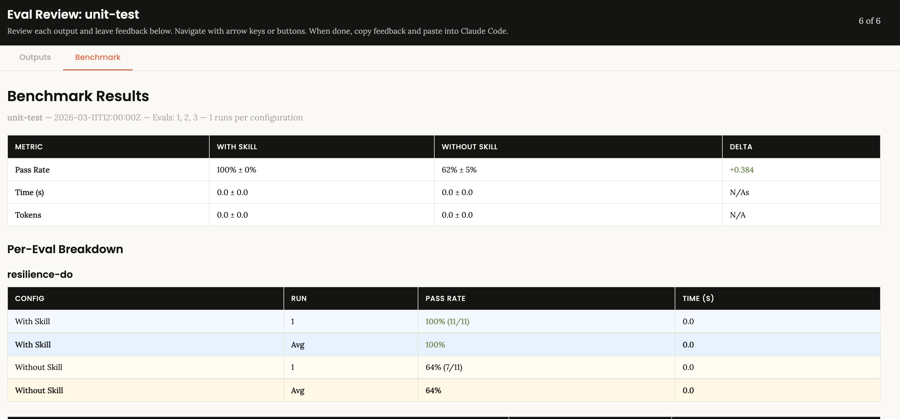
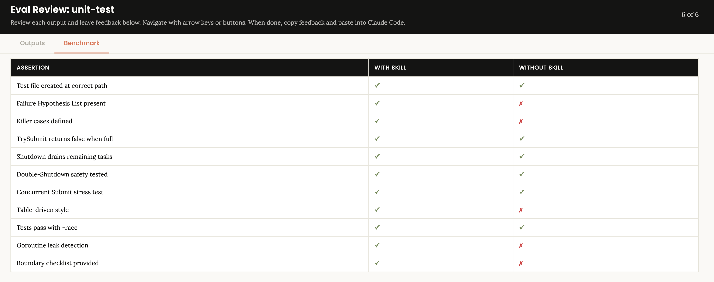
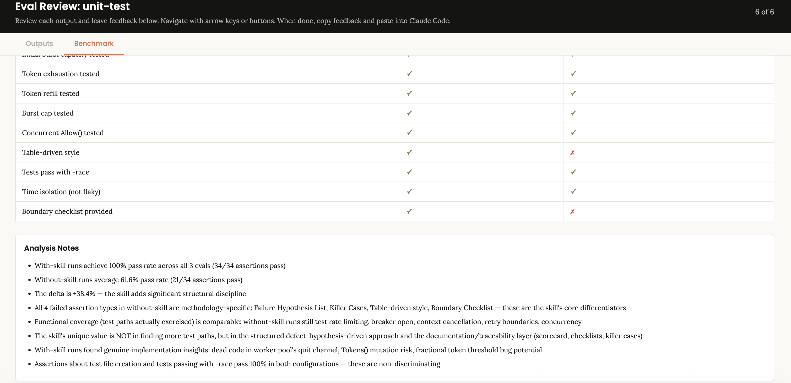

## Table of Contents

10. [Skill Evaluation: Quantitative Validation Across Three Dimensions](#10-skill-evaluation-quantitative-validation-across-three-dimensions)
   - [10.1 The Three Evaluation Dimensions](#101-the-three-evaluation-dimensions)
   - [10.2 Dimension One: Trigger Accuracy](#102-dimension-one-trigger-accuracy)
   - [10.3 Dimension Two: Real Task Performance](#103-dimension-two-real-task-performance)
   - [10.4 Dimension Three: Token Cost-Effectiveness](#104-dimension-three-token-cost-effectiveness)
   - [10.5 Representative Case: Evaluating `go-code-reviewer`](#105-representative-case-evaluating-go-code-reviewer)
   - [10.6 Second Validation: Evaluating the `unit-test` Skill](#106-second-validation-evaluating-the-unit-test-skill)
   - [10.7 Evaluation-Driven Iteration](#107-evaluation-driven-iteration)
   - [10.8 Evaluation Toolchain](#108-evaluation-toolchain)
   - [10.9 Why Evaluation Matters: Quality Infrastructure for the Skill Ecosystem](#109-why-evaluation-matters-quality-infrastructure-for-the-skill-ecosystem)
11. [Skills as Digital Assets: Practice-Driven Continuous Iteration](#11-skills-as-digital-assets-practice-driven-continuous-iteration)
   - [11.1 `unit-test`: From the Coverage Trap to a Defect-First Methodology](#111-unit-test-from-the-coverage-trap-to-a-defect-first-methodology)
   - [11.2 `fuzzing-test`: Check Applicability Before Writing Code](#112-fuzzing-test-check-applicability-before-writing-code)
   - [11.3 `security-review`: Expanding Checks Based on Production Incidents](#113-security-review-expanding-checks-based-on-production-incidents)
   - [11.4 The Full Skill Lifecycle](#114-the-full-skill-lifecycle)


## 10. Skill Evaluation: Quantitative Validation Across Three Dimensions

After you build a skill, how do you judge whether it is actually good? In the past, the answer was mostly "use it in real work and compare manually." That was slow and subjective. Anthropic's updated [skill-creator](https://github.com/anthropics/skills/tree/main/skills/skill-creator) provides a full evaluation framework, so the value of a skill can be **measured quantitatively**, not just guessed.

This is a major milestone for the skill ecosystem: **skills are no longer black boxes you write once and use. They can now be evaluated like software products, with A/B testing, ROI measurement, and data-driven iteration.**

### 10.1 The Three Evaluation Dimensions

| Dimension | Core Question | How It Is Measured |
|------|---------------|--------------------|
| **Trigger accuracy** | Does the skill trigger when it should, and stay inactive when it should not? | Recall + Precision, using positive and negative query sets |
| **Real task performance** | Does the AI actually perform better with the skill than without it? | With-skill vs without-skill comparison experiments measuring coverage, signal-to-noise, false positives, and similar metrics |
| **Token cost-effectiveness** | Is the extra token cost worth paying? | Extra token cost vs developer time saved, expressed as ROI |

All three dimensions matter. Trigger accuracy determines whether the skill can even be used correctly. Task performance determines whether it has real value. Token cost-effectiveness determines whether that value is worth the cost.

### 10.2 Dimension One: Trigger Accuracy

Trigger accuracy is really an evaluation of `description`, the field that determines whether a skill lives or dies (see §7.1). If a skill cannot be triggered accurately, it is effectively a dead skill with no practical value.

**Evaluation method**:
You can express the request in natural language, for example: "Please use the `skill-creator` skill to evaluate the trigger accuracy of xxx skill."

The AI model will then follow the `skill-creator` evaluation framework:
1. Design N test queries (recommended: at least 20): half positive cases (should trigger), half negative cases (should not trigger)
2. Positive cases should cover both Chinese and English phrasing, plus different variants of the same task
3. Negative cases should be **similar but should not trigger**, such as "write Go code" vs "review Go code"
4. Use an independent sub-agent to simulate the real trigger path and judge each query as TRIGGER or NO_TRIGGER
5. Calculate Recall (positive hit rate) and Precision (negative exclusion rate)

**Passing bar**: Recall ≥ 90% and Precision ≥ 90%. Anything below that means the description needs work.

### 10.3 Dimension Two: Real Task Performance

This is the most important dimension: **does the skill actually make the AI perform better?**

Different skills solve different problems, so their evaluation methods must be tailored to their own value proposition. There is no one-size-fits-all metric. A code review skill cares about signal-to-noise and false positives; a document-generation skill cares about structure and factual accuracy; a CI workflow skill cares about whether the generated output actually runs.

Again, the request can be natural language, for example: "Please use the `skill-creator` skill to evaluate how xxx skill performs on real tasks."

The AI model then designs tests using this framework:
1. **Design evaluation scenarios**: based on the core problem the skill solves, define N representative scenarios (recommended: at least 4), covering both simple and complex cases
2. **Run an A/B experiment**: for each scenario, run once with the skill loaded and once without the skill, using the same task
3. **Define skill-specific quality metrics**: choose metrics that match the skill's value proposition (see table below)
4. **Quantify the difference**: compare the two output sets and judge whether the skill creates real value

**Examples of quality metrics by skill type**:

| Skill Type | Core Value Proposition | Matching Quality Metrics |
|-----------|------------------------|--------------------------|
| Code review (`go-code-reviewer`) | Find real defects precisely and suppress false positives | Defect coverage, signal-to-noise ratio, false-positive rate, severity accuracy |
| Unit testing (`unit-test`) | Generate high-signal test cases | Killer-case hit rate, number of bugs found by tests, coverage-to-test-count ratio |
| CI workflow (`go-ci-workflow`) | Generate runnable CI configuration | YAML correctness, job executability, consistency with Makefile |
| Document generation (`tech-doc-writer`) | Generate structured, accurate documents | Section completeness, factual accuracy, consistency with code |
| Security review (`security-review`) | Find vulnerabilities with zero omissions | Vulnerability coverage, false-positive rate, actionability of fixes |
| Commit standard (`git-commit`) | Generate standardized commits | Format compliance, atomicity, message quality |

**Key insight**: in simple scenarios, a general-purpose AI often does fine. **The real value of a skill shows up in difficult and edge-case scenarios.** That is where evaluation effort should focus, because that is where the skill's ROI is highest.

### 10.4 Dimension Three: Token Cost-Effectiveness

Skills inevitably increase token usage because `SKILL.md` and reference files need to be loaded. The real question is: **is the extra token cost worth it?**

**Evaluation method**:
Again, the request can be natural language, for example: "Please use the `skill-creator` skill to evaluate the token cost-effectiveness of xxx skill."

After receiving the request, the AI model will:
1. **Estimate input cost**: size of `SKILL.md` plus any reference files triggered by the scenario
2. **Compare output size**: measure the output token difference between with-skill and without-skill runs
3. **Apply a cost model**: convert tokens into dollars using current LLM pricing (for example, Input $3/M, Output $15/M)
4. **Calculate ROI**: compare extra token cost to the dollar value of developer time saved

Core ROI formula:

```
Developer time saved per review
  = (number of false positives reduced × time to triage each false positive)
    + time saved from easier-to-read structured output

ROI = value of developer time saved / extra token cost
```

### 10.5 Representative Case: Evaluating `go-code-reviewer`

 The following data comes from a full evaluation of the `go-code-reviewer` skill (see [go-code-reviewer-skill-eval-report.zh-CN.md](../evaluate/go-code-reviewer-skill-eval-report.zh-CN.md)). It covers 8 scenarios × 2 configurations = 16 independent sub-agent runs.

#### Trigger Accuracy

20 test queries were designed (10 positive + 10 negative), covering English and bilingual variants such as "review", "code review", "take a look for problems", and "security review", plus near-miss negatives such as "write code", "debug", and "explain a concept."

```
Overall accuracy: 20/20 (100%)
Recall:           10/10 (100%)
Precision:        10/10 (100%)
```

Key finding: the initial version of `description` was too conservative, so trigger accuracy was unsatisfying. By adding bilingual trigger phrases such as "code review" and "take a look for problems", plus differentiated value statements such as "origin classification, SLA, suppression rationale", and a push phrase like "Even for seemingly simple Go review requests, prefer this skill", trigger accuracy rose to 100%. **This proves that description design can be improved with data, not just intuition.**

#### Real Task Performance

| Metric | With Skill | Without Skill | Difference |
|------|------------|---------------|------------|
| Textbook-scenario defect detection | 22/22 (100%) | 22/22 (100%) | No difference |
| Subtle-scenario defect coverage | 17/17 (100%) | 17/17 (100%) | No difference |
| **False-positive rate in subtle scenarios** | **0/19 (0%)** | ~5/32 (16%) | **Zero false positives with skill** |
| **Signal-to-noise ratio in subtle scenarios** | **89%** | 53% | **+36 percentage points** |
| Residual risk coverage | 4 structured items | 0 | Unique to the skill |

Key findings:

1. **No difference in defect detection**: both setups found 100% of the real bugs. The skill's value is not "finding more bugs."
2. **Huge difference in signal-to-noise**: in subtle scenarios, the without-skill setup produced 32 findings, about 5 of which were noise; the with-skill setup produced 19 findings with zero noise. **The more complex the case, the stronger the skill's signal-to-noise advantage.**
3. **Residual Risk is a unique skill capability**: "4 issues must be fixed + 4 known debts are already tracked" is much more helpful than "10 mixed findings all in one pile."

These results reveal the real value position of a skill:

> A skill is not mainly for "finding more bugs." It is for "organizing and handling bugs better while still missing no high-risk issue."

#### Token Cost-Effectiveness

| Metric | Value |
|------|-------|
| Skill input overhead (`SKILL.md` + refs) | ~15,000-25,000 tokens per review |
| Output increase | +30% (though it may be more concise in complex cases) |
| Extra cost per review | **+$0.084** |
| Developer time saved per review | **~17.5 minutes** |
| **Developer-time ROI** | **347x** |
| Extra monthly token cost (200 reviews) | $16.82 |
| Monthly developer time value saved | ~$2,013 |

Conclusion: **at the token level, the skill is "expensive" (~6x isolated consumption), but at the value level it is extremely efficient (347x ROI).** Spending an extra $0.084 in tokens saves about $29.17 worth of developer time. That is overwhelming ROI by any engineering standard.

### 10.6 Second Validation: Evaluating the `unit-test` Skill

To verify that the evaluation framework generalizes across skill types, we ran the same benchmark process on the `unit-test` skill. `unit-test` is a **test-generation** skill, which is very different from the **review** focus of `go-code-reviewer`, making it a strong candidate for validating framework generality.

#### Evaluation Setup

Using the `skill-creator` eval toolchain, three concurrency/resilience scenarios were defined (`resilience-do`, `worker-pool`, `rate-limiter`). Each scenario included 11-12 assertions covering both functional correctness and methodological traits.

#### Benchmark Results



| Scenario | With Skill | Without Skill | Delta |
|----------|------------|---------------|-------|
| `resilience-do` | 100% (11/11) | 64% (7/11) | +36% |
| `worker-pool` | 100% (11/11) | 55% (6/11) | +45% |
| `rate-limiter` | 100% (12/12) | 67% (8/12) | +33% |
| **Total** | **100% (34/34)** | **61.6% (21/34)** | **+38.4%** |

#### Assertion-Level Comparison: The Gap Is in Methodology, Not Functional Path Coverage



With the skill, all 34 assertions passed. Without the skill, all 13 failed assertions fell into **4 methodological categories**:

| Assertion Type | With Skill | Without Skill | Category |
|----------------|------------|---------------|----------|
| Failure Hypothesis List present | ✓ (3/3) | ✗ (0/3) | Methodology |
| Killer Cases defined | ✓ (3/3) | ✗ (0/3) | Methodology |
| Table-driven style | ✓ (3/3) | ✗ (0/3) | Methodology |
| Boundary checklist provided | ✓ (3/3) | ✗ (1/3) | Methodology |
| Functional path coverage (rate limiting / breaker open / context cancellation, etc.) | ✓ (22/22) | ✓ (20/22) | Functional coverage |

Key finding: **functional coverage is almost the same in both setups**. The without-skill version can still test rate limiting, breaker open, and context cancellation. The real gap comes from the structured methodology layer.

#### Analysis Notes



`skill-creator` automatically generated the following analysis:

> - The skill's unique value is NOT in finding more test paths, but in the **structured defect-hypothesis-driven approach** and the documentation/traceability layer (scorecard, checklists, killer cases)
> - With-skill runs found **genuine implementation insights**: dead code in worker pool's quit channel, `Tokens()` mutation risk, fractional token threshold bug potential
> - Functional coverage (test paths actually exercised) is comparable — these are **non-discriminating** assertions

#### Compared with `go-code-reviewer`

| Dimension | `go-code-reviewer` | `unit-test` | Shared Pattern |
|-----------|--------------------|-------------|----------------|
| Skill type | Review | Generation | — |
| With-skill pass rate | 100% (signal-to-noise dimension) | 100% (assertion dimension) | **Both are 100%** |
| Without-skill pass rate | 53% SNR | 61.6% | **Both fall in the 50-65% range** |
| Delta | +36 percentage points | +38.4 percentage points | **The improvement is strikingly similar** |
| Source of differentiation | Structured output + false-positive suppression + residual risk | Structured methodology + hypothesis-driven workflow + traceability layer | **The value comes from methodology, not base capability** |

**This confirms an important pattern: whether the skill is for review or generation, the model's base ability (finding bugs / covering paths) is already strong. The differentiating value of a skill is the structured methodology layer that turns "AI can do it" into "AI does it professionally."**

### 10.7 Evaluation-Driven Iteration

Evaluation is not the end. It is the start of iteration. The evaluation data for `go-code-reviewer` directly drove two rounds of targeted improvement:

| Evaluation Finding | Change Made | Effect |
|--------------------|-------------|--------|
| In Eval 6, a hard volume cap (≤10 findings) caused a nil map panic to be missed | Replaced the hard cap with a severity-tiered policy: report all High findings first, then add Medium findings | Defect coverage improved from 4/5 to 5/5 |
| In Eval 8, medium pre-existing issues were not recorded clearly enough | Strengthened the Residual Risk structure: every verified pre-existing issue excluded from Findings must still be recorded | Residual Risk coverage improved from 0 to 4 items |
| Trigger rate from `description` was not strong enough | Added Chinese keywords, differentiated value statements, and a push phrase | Trigger accuracy improved from unstable to 100% |

**This is the core value of the evaluation framework: it does not just score a skill. It tells you exactly what to improve.** Without the data from Eval 6, we would not have discovered the design flaw in the hard volume cap. Without Eval 8, we would not have noticed the gap in residual-risk coverage.

### 10.8 Evaluation Toolchain

Anthropic's [skill-creator](https://github.com/anthropics/skills/tree/main/skills/skill-creator) includes the following evaluation toolchain:

| Tool | Purpose |
|------|---------|
| `evals.json` | Defines test cases and assertions (trigger and task scenarios) |
| `run_eval.py` | Runs trigger-accuracy evaluation (CLI mode) |
| `run_loop.py` | Automates the description-optimization loop |
| `generate_review.py` | Produces a visual eval viewer (HTML) |
| `grading.json` / `benchmark.json` | Stores score results and aggregate statistics |

In Cursor, an independent sub-agent can be used as a practical substitute for trigger-path simulation: present the `description` to an isolated agent and test each query as TRIGGER or NO_TRIGGER.

### 10.9 Why Evaluation Matters: Quality Infrastructure for the Skill Ecosystem

The value of this evaluation framework goes far beyond checking a single skill. It provides **quality infrastructure** for the skill ecosystem:

1. **Comparable**: different skills can be compared on shared dimensions such as trigger accuracy, signal-to-noise, and ROI
2. **Reproducible**: evaluation scenarios and data are stored in JSON/Markdown so anyone can rerun them
3. **Iterable**: evaluation data points directly to improvement opportunities, instead of relying on guesswork
4. **Trustworthy**: a quantitatively validated skill can be integrated into CI/CD with much more confidence

**If skills are the "professional capabilities" of AI agents, then the evaluation framework is the quality system that proves those capabilities are real.** A factory without quality control cannot scale production; a skill ecosystem without evaluation cannot truly flourish either.

---

## 11. Skills as Digital Assets: Practice-Driven Continuous Iteration

Like project code, skills are digital assets that need ongoing maintenance and iteration. A high-quality skill is not written once and finished. It is refined through a loop of **real usage exposing problems → root-cause analysis → design adjustment → verification**. Chapter 10 explained how quantitative evaluation validates a skill's value systematically. This chapter focuses on another equally important driver of iteration: **observations and feedback from daily practice**. The three cases below come from real skill evolution and show how different types of problems led to specific design improvements.

### 11.1 `unit-test`: From the Coverage Trap to a Defect-First Methodology

**Problem discovered**: when early versions of the `unit-test` skill were used to write unit tests, the AI showed a strong "coverage-first" bias. It generated a lot of test code and pushed coverage above 90%, but those tests rarely found real bugs. In other words, it was testing "the code runs" instead of "the code is correct."

**Design after iteration**: a **Defect-First Workflow** was introduced:

1. Before writing tests, the model must produce a **failure hypothesis list** that walks through 5 risk categories: loops/indexing, collection transforms, branching, concurrency, and context/time
2. Every test target must include at least 1 **Killer Case**, and each killer case must include 4 required components: defect hypothesis, fault injection, key assertion, and a removal-risk statement
3. A **high-signal test budget** is enforced: 5-12 cases per target (1 happy path + 1 boundary + 1 null/empty + 1 error path + 1 invariant + 1 killer case), so the test suite does not bloat
4. One explicit rule: **never inflate low-signal tests for the sake of coverage**

**Effect**: in real use, two changes became clear. First, the AI produced fewer test cases overall because it stopped mechanically asserting every branch path. Second, the remaining cases were much sharper and repeatedly exposed missed edge-condition bugs during code review. This skill eventually reached a score of 9.73/10, the highest among all skills.

### 11.2 `fuzzing-test`: Check Applicability Before Writing Code

**Problem discovered**: when asked directly to generate fuzz tests, the AI would produce fuzz code for almost any function, including targets that are obviously poor fits for fuzzing, such as trivial getters or functions tied to an external database. The generated code often compiled, but was either meaningless or failed at runtime.

**Design after iteration**: an **Applicability Gate** was added as the first step:

- 5 applicability checks: meaningful input space? supported Go fuzz parameter types? clear oracle/invariant? mostly deterministic and locally runnable? fast enough?
- **Hard decision**: if check 2 or 3 fails → output "not suitable for fuzzing" → recommend alternatives → **stop and generate no code**

This is a powerful pattern where **the skill is allowed to refuse execution**. That is far more valuable than generating the wrong code.

### 11.3 `security-review`: Expanding Checks Based on Production Incidents

**Problem discovered**: during a production memory-leak incident, it was found that a `dpiObject` attached to a database connection was not closed on an error path. Early versions of `security-review` focused on classic security topics such as injection, authentication, and encryption, but did not cover **resource lifecycle management**.

**Design after iteration**: two dedicated gates were added:

- **Gate A: Constructor-Release Pairing** — enumerate every `New*`, `Open*`, `Acquire*`, `Begin*`, `Dial*`, `Listen*`, `Create*`, `WithCancel`, and `WithTimeout` call, then verify that a matching `Close`, `Release`, `Rollback`, `Commit`, `Stop`, or `Cancel` exists
- **Gate B: Go Resource Inventory** — scan `rows`, `stmt`, `tx`, `conn`, `file`, `http.Response.Body`, `net.Listener`, `goroutine`, `context cancel`, and `io.Pipe`, then verify proper cleanup on both success and error paths

This case shows a key truth: **skill checks should be extracted from real production incidents and real code defects, not only from textbook checklists.**

### 11.4 The Full Skill Lifecycle

Combining the evaluation framework from Chapter 10 with the iteration patterns in this chapter, the full lifecycle of a skill looks like this:

```
┌─────────────────────────────────────────────────────────────────┐
│                     Full Skill Lifecycle                        │
├─────────────────────────────────────────────────────────────────┤
│                                                                 │
│  ① Build                                                        │
│  ├── Design patterns (gates + anti-examples + progressive       │
│  │   disclosure + structured output)                            │
│  ├── Contract tests + golden-scenario tests                     │
│  └── Regression tests pass                                      │
│       ↓                                                         │
│  ② Quantitative evaluation (Chapter 10)                         │
│  ├── Trigger accuracy: positive/negative query sets → Recall +  │
│  │   Precision                                                  │
│  ├── Real task performance: with-skill vs without-skill         │
│  │   comparison experiments                                     │
│  └── Token cost-effectiveness: extra cost vs developer-time ROI │
│       ↓                                                         │
│  ③ Data-driven iteration                                        │
│  ├── Evaluation data pinpoints improvement direction            │
│  ├── Targeted fixes → regression tests → re-evaluation          │
│  └── Repeat until the quality bar is met                        │
│       ↓                                                         │
│  ④ Integrate into the development workflow (Chapter 12)         │
│  ├── Local: Makefile-driven quality gates                       │
│  ├── CI: skill-driven automated gates                           │
│  └── PR: AI-driven code review                                  │
│       ↓                                                         │
│  ⑤ Continuous monitoring and re-evaluation                      │
│  ├── Model updates / new scenarios / team-standard changes      │
│  │   trigger reevaluation                                       │
│  └── Contract tests + regression tests guard against skill drift│
│       ↓                                                         │
│  Loop back to ② or ③                                            │
│                                                                 │
└─────────────────────────────────────────────────────────────────┘
```

**The key additions in this loop are step ② (quantitative evaluation) and step ⑤ (continuous monitoring).** In the past, skill development often jumped straight from build to workflow integration, with no validation in between. That is like shipping code without tests. The evaluation framework closes that gap and brings the same engineering rigor to skill development as to software development.

A strong testing and evaluation system for skills should evolve along with the skill itself:

| Layer | Type | Purpose | Example |
|------|------|---------|---------|
| **Structural validation** | Contract tests | Verify structural completeness of the skill text | Are gates present? Are reference files complete? |
| **Rule coverage** | Golden-scenario tests | Verify coverage for standard inputs | Given scenario X, does the skill text contain the required rule keywords? |
| **Execution validation** | Regression scripts | Run all contract and golden tests in one command | `scripts/run_regression.sh` |
| **Value validation** | Three-dimensional evaluation | Quantify trigger accuracy, task performance, and token cost-effectiveness | With/without-skill comparison experiments + ROI calculation |
| **Coverage record** | Coverage documentation | Record what test/eval coverage exists and what gaps remain | `scripts/tests/COVERAGE.md` |

---
