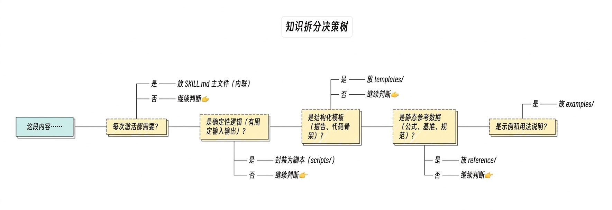

## Table of Contents

1. [Why Skills Exist](#1-why-skills-exist)
    - [1.1 The Context Problem of AI Coding Assistants](#11-the-context-problem-of-ai-coding-assistants)
    - [1.2 From Prompt to Reusable Knowledge Unit](#12-from-prompt-to-reusable-knowledge-unit)
2. [A Basic Introduction to Skills](#2-a-basic-introduction-to-skills)
    - [2.1 What a Skill Looks Like](#21-what-a-skill-looks-like)
    - [2.2 Two Classification Dimensions](#22-two-classification-dimensions)
    - [2.3 How a Skill Is Invoked](#23-how-a-skill-is-invoked)
    - [2.4 Frontmatter Field Reference](#24-frontmatter-field-reference)
3. [Deployment Locations and Use Cases](#3-deployment-locations-and-use-cases)
    - [3.1 When You Do Not Need a Skill](#31-when-you-do-not-need-a-skill)
    - [3.2 Build Your First Skill: Iterate First, Extract Later](#32-build-your-first-skill-iterate-first-extract-later)
    - [3.3 Distribution Channels: From Local to API](#33-distribution-channels-from-local-to-api)
4. [Advanced Structure: Wrapper Scripts and Supporting Docs](#4-advanced-structure-wrapper-scripts-and-supporting-docs)
    - [4.1 What Each Directory Is For](#41-what-each-directory-is-for)
    - [4.2 Why Wrapping Logic in Scripts Matters](#42-why-wrapping-logic-in-scripts-matters)
5. [Progressive Disclosure: An Elegant Answer to AI Context Limits](#5-progressive-disclosure-an-elegant-answer-to-ai-context-limits)
    - [5.1 Core Idea](#51-core-idea)
    - [5.2 Selective Loading Table](#52-selective-loading-table)
    - [5.3 Add a Table of Contents to Long Files](#53-add-a-table-of-contents-to-long-files)
    - [5.4 Three Principles for the Main File: Quick Reference, 80/20 Split, and Contractual References](#54-three-principles-for-the-main-file-quick-reference-8020-split-and-contractual-references)
    - [5.5 Content Splitting Decision Tree: Five Principles](#55-content-splitting-decision-tree-five-principles)

## 1. Why Skills Exist

### 1.1 The Context Problem of AI Coding Assistants

Large language models (LLMs) are excellent at code generation and review, but they have one fundamental limitation: **the context window is a shared and finite resource**. Every instruction, document, and message in the conversation consumes part of that window. As projects grow, teams need to pass more standards, workflows, and templates to the AI, and the strategy of "put everything into `CLAUDE.md`" quickly stops working:

- Once `CLAUDE.md` grows past 200 lines, instruction-following starts to degrade
- Different tasks need different domain knowledge, but loading everything wastes tokens
- Team members keep their own prompt snippets, so knowledge does not accumulate or get reused

### 1.2 From Prompt to Reusable Knowledge Unit

Skills exist to solve this exact problem: **they package reusable domain knowledge and workflows into separate, on-demand modules**. They follow the [Agent Skills Open Standard](https://agentskills.io/) and are not tied to a single platform.

Compared with traditional prompt engineering, the key differences are:

| Dimension | Traditional Prompt | Skill |
|------|--------------------|-------|
| Lifecycle | One-time use | Persistent, version-controlled, shareable across a team |
| Loading model | Fully loaded every time | Loaded on demand, so unused knowledge costs no context |
| Testability | Cannot be verified | Can have contract tests and regression tests |
| Scope of reuse | Personal clipboard | Enterprise → personal → project deployment layers |
| Iteration model | Improved from memory | Reviewed, committed, and validated like code |

---

## 2. A Basic Introduction to Skills

### 2.1 What a Skill Looks Like

In its simplest form, a skill only needs one file: `SKILL.md`.

```
my-skill/
└── SKILL.md
```

`SKILL.md` has two parts:

```markdown
---
name: my-skill
description: Describe what the skill does and when it should trigger. Claude uses this text to decide whether to auto-load it.
---

# My Skill

This is the instruction body Claude follows when the skill runs.
```

- **YAML frontmatter** (between `---`) tells Claude **when** to use the skill
- **Markdown body** tells Claude **how** to do the work

### 2.2 Two Classification Dimensions

**By content type:**

| Type | Purpose | Typical Scenarios | Invocation Control |
|------|---------|-------------------|--------------------|
| **Knowledge skill** | Transfer domain knowledge, coding standards, and review criteria | Code review, security checks, performance guidance | Default: Claude decides whether to load it |
| **Task skill** | Define concrete steps for workflows with side effects | Commit code, create PRs, deploy releases | Recommended: `disable-model-invocation: true` |

**By use domain** (from Anthropic's official guide):

| Category | Purpose | Typical Skills | Key Technique |
|------|---------|----------------|---------------|
| **Docs & asset creation** | Produce consistent, high-quality docs, decks, designs, or code | `frontend-design`, `docx`, `pptx`, `xlsx` | Embedded style guides, template structures, quality checklists |
| **Workflow automation** | Multi-step processes that need a consistent method | `skill-creator`, `git-commit` | Step-by-step workflows, validation gates, iterative refinement loops |
| **MCP enhancement** | Add workflow guidance on top of MCP tool access | `sentry-code-review` | Coordinating multiple MCP calls, embedding domain expertise, handling errors |

These two dimensions are orthogonal and complementary: knowledge/task describes the nature of the content, while the three domains describe the kind of problem it solves.

### 2.3 How a Skill Is Invoked

- **User-triggered**: type `/skill-name` in Claude Code
- **Auto-loaded by Claude**: Claude checks whether the current task matches the `description` in frontmatter
- **Arguments**: supports `$ARGUMENTS` (all arguments), `$0`, and `$1` (positional arguments)

### 2.4 Frontmatter Field Reference

**Required fields:**

| Field | Purpose | Example |
|------|---------|---------|
| `name` | Display name and `/` command name. **Must be kebab-case**. No spaces, uppercase letters, or underscores | `go-code-reviewer` |
| `description` | **The most important field** because Claude uses it for auto-triggering. Maximum **1024 characters**. XML tags (`<` `>`) are not allowed | `Review Go code with a defect-first approach...` |

**Optional fields:**

| Field | Purpose | Example |
|------|---------|---------|
| `disable-model-invocation` | Set to `true` to prevent Claude from auto-triggering the skill | Useful for side-effecting operations such as `/commit` or `/deploy` |
| `allowed-tools` | Limits which tools can be used while the skill is active | `Read, Grep, Glob, Bash` |
| `context` | Set to `fork` to run in an isolated sub-agent | Useful for research-style tasks that need independent context |
| `license` | Open-source license | `MIT`, `Apache-2.0` |
| `compatibility` | Environment requirements (1-500 chars) | `Requires Node.js 18+, network access for API calls` |
| `metadata` | Custom key-value pairs such as author, version, or MCP dependency | `author: John`, `version: 1.0.0`, `mcp-server: linear` |

**Security restrictions:**
- XML angle brackets (`< >`) are forbidden in `description` because frontmatter is injected into the system prompt, and malicious content could turn into instructions
- Skill names cannot include `claude` or `anthropic` (reserved prefixes)
- The skill folder name must match `name` and use kebab-case

---

## 3. Deployment Locations and Use Cases

Skills support four deployment levels. Higher-priority levels override lower-priority ones:

| Priority | Level | Path | Best Use |
|----------|-------|------|----------|
| 1 (highest) | Enterprise | Distributed through managed settings | Organization-wide security review standards, compliance checks |
| 2 | Personal | `~/.claude/skills/<name>/SKILL.md` | Personal writing style, common workflows |
| 3 | Project | `.claude/skills/<name>/SKILL.md` | Project-specific coding standards, CI setup |
| 4 (lowest) | Plugin | `<plugin>/skills/<name>/SKILL.md` | General capabilities reused across projects |

**How to choose:**

- **Security review, coding standards** → enterprise deployment so everyone follows the same rules
- **Personal productivity tools** (such as `tech-doc-writer`, `google-search`) → personal deployment
- **Project-specific workflows** (such as a particular CI workflow or PR template) → project deployment committed to Git
- **Shared general-purpose tools for a team** → plugin distribution

### 3.1 When You Do Not Need a Skill

Not all knowledge should be packaged as a skill. In the following cases, another mechanism is a better fit:

| Scenario | Use This Instead of a Skill | Why |
|------|------------------------------|-----|
| Fewer than 50 lines and needed in every session | `CLAUDE.md` | Full loading is simpler, and on-demand loading adds little value |
| Rules only apply to certain file types (for example, `.proto` coding standards) | `.claude/rules/` with `paths` | Rules can match files precisely with globs, unlike skill triggering via `description` |
| A step must run 100% of the time and cannot be "forgotten" by AI (for example, run lint before commit) | Hook | Hooks run deterministically with zero context cost; skills are prompts and may be skipped |
| You only need external API access (for example, query GitHub issues or send email) | MCP server | MCP provides tools; skills provide knowledge and workflow. Do not reimplement API logic in a skill |
| The instruction is truly one-off and will not be reused | Say it directly in the conversation | A temporary instruction is not worth turning into a permanent module |

**Rule of thumb**: if a piece of knowledge (1) is reused repeatedly, (2) is longer than 50 lines, and (3) is not needed in every session, then it is a good candidate for a skill. If all three conditions are not met, prefer a lighter-weight mechanism.

### 3.2 Build Your First Skill: Iterate First, Extract Later

Use "check Go code formatting" as an example to show the full path from a normal conversation to a reusable skill. The process has two stages: first, manual iteration to produce a working draft; then, hardening with skill-creator to bring it to production quality.

**Step 1: Solve the same task repeatedly in normal chat**

Do not rush to write `SKILL.md`. Start by simply asking in Claude Code:

```
> Help me check whether the current project has any improperly formatted Go files, and fix them if it does
```

Claude will run `gofmt -l .`, find problem files, and fix them. But you may notice the behavior is not ideal. For example, it may edit files under `vendor/`, fail to prefer `goimports`, or skip a second verification pass.

So you keep correcting it in chat:

```
> Do not touch the vendor directory. If goimports is available, prefer it. After fixing, run it again to verify
```

Repeat this two or three times until the workflow feels right. At that point, you already have a validated process in your head.

**Step 2: Extract the successful method into `SKILL.md`**

Now create the skill. You are no longer inventing instructions from scratch. You are turning a proven prompt into a reusable artifact:

```bash
mkdir -p ~/.claude/skills/fmt-check
```

Write this to `~/.claude/skills/fmt-check/SKILL.md`:

```markdown
---
name: fmt-check
description: >
  Check and fix Go code formatting issues. Triggers when the user asks
  to format code, check formatting, or fix style issues in Go files.
---

# Format Check

## Workflow

1. Run `gofmt -l .` to list files with formatting issues.
2. If no files found, report "All files properly formatted."
3. If files found, run `gofmt -w <file>` for each file.
4. Run `gofmt -l .` again to verify all issues are fixed.
5. Report which files were modified.

## Rules

- Never modify files outside the current Go module.
- If `goimports` is available, prefer it over `gofmt` (it also handles imports).
```

Every rule in this `SKILL.md` comes from the real corrections in Step 1. "Do not touch vendor" becomes a boundary rule. "Prefer goimports" becomes a tool-selection rule. "Verify after fixing" becomes Step 4 in the workflow.

**Step 3: Harden with skill-creator**

A manually written SKILL.md works, but it has blind spots:

- The description may not trigger for all valid phrasings (e.g., a user says "check go formatting" instead of "format code")
- Two or three rounds of conversation corrections cover only a limited set of edge cases
- There is no objective data showing whether the skill actually improves AI output

Anthropic's official [skill-creator](https://github.com/anthropics/skills/tree/main/skills/skill-creator) automates the hardest parts of this process — the parts that manual creation most easily skips:

1. **Interview-driven gap analysis** — systematically asks about trigger scenarios, expected output format, edge cases, and test cases, reducing omissions caused by limited experience
2. **Automatic eval generation and execution** — creates test scenarios and runs with-skill vs without-skill comparisons in parallel, replacing guesswork with data
3. **Description optimization loop** — generates 20 should-trigger and should-not-trigger queries, then runs an optimization loop with train/test split. This is the hardest part to do manually and has the biggest impact on whether the skill actually gets used
4. **Visual eval viewer** — a browser-based UI for reviewing outputs and benchmark comparisons, closing the feedback loop

Continuing with the fmt-check example, invoke it directly in Claude Code:

```
> Use skill-creator to evaluate and improve the fmt-check skill
```

skill-creator might discover that the description misses the common phrasing "check go formatting" (causing trigger failures), that multi-module monorepos are an unhandled edge case, and that "format my Python code" incorrectly triggers this skill. These issues are very hard to catch through manual creation alone.

> For the full three-dimensional evaluation methodology (trigger accuracy, task performance, token cost-effectiveness) and real case studies, see Chapter 10.

**Step 4: Use it and keep iterating**

In Claude Code, you can now:
- Type `/fmt-check` to invoke it directly
- Or simply say "help me check the code formatting", and Claude will auto-load the skill based on the description

After using it a few times, you may discover new improvements:
- Need support for `goimports-reviser` → add it to the Rules section
- Need the same workflow in CI → move the skill from `~/.claude/skills/` to the project's `.claude/skills/` and commit it to Git
- After significant changes, re-run skill-creator evaluation to verify the changes did not introduce regressions

**When is manual creation enough?**

- Personal use, simple workflow, low stakes — Steps 1-2 are sufficient
- Shared with a team, broad trigger surface, complex edge cases — run it through skill-creator. Even if you choose to create manually, at minimum do two things: run a quick eval with 2-3 test cases (exposes hidden issues) and run one round of description optimization (small effort, high impact). An under-triggering skill is a dead skill

This is the core creation path for a skill: **iterate in conversation → extract into a skill → harden with skill-creator → keep improving through real use**. The full lifecycle also includes **quantitative evaluation** (Chapter 10) and **workflow integration** (Chapter 12): **build → evaluate → improve → integrate → monitor**. The later chapters cover best practices for each step.

### 3.3 Distribution Channels: From Local to API

Beyond the four local deployment levels above (§3), skills can also be distributed more broadly:

| Channel | Best Use | Notes |
|------|----------|-------|
| **Upload to Claude.ai** | Individual users | Go to Settings > Capabilities > Skills and upload a zip file |
| **Claude Code directory** | Developers | Put the skill under `~/.claude/skills/` or `.claude/skills/` |
| **Organization-wide deployment** | Enterprise teams | Centrally distributed by admins, with auto-update and centralized management (launched in Dec 2025) |
| **Skills API** | Programmatic integration | Use the `/v1/skills` endpoint and inject via the `container.skills` parameter; supported by the Claude Agent SDK |
| **GitHub hosting** | Community sharing | Public repository + README (note: do not put `README.md` inside the skill folder; keep it at repo root) |

**API vs interactive use**: use Claude.ai or Claude Code for day-to-day development and manual testing; use the API for production deployment, automation pipelines, or agent systems. The Skills API requires the Code Execution Tool beta.

Skills follow the [Agent Skills Open Standard](https://github.com/anthropics/agent-skills), which gives them **cross-platform portability** by default. The same skill can run on Claude.ai, Claude Code, and the API without modification.

---

## 4. Advanced Structure: Wrapper Scripts and Supporting Docs

Once a skill becomes too complex for a single file, you need a richer directory structure. Using the `go-ci-workflow` skill (rated 9.5/10) as an example:

```
go-ci-workflow/
├── SKILL.md                           # Entry point: 236-line operating framework
├── agents/
│   └── openai.yaml                    # UI metadata
├── scripts/
│   ├── discover_ci_needs.sh           # Repo shape discovery script
│   ├── run_regression.sh              # Regression test runner
│   └── tests/
│       ├── COVERAGE.md                # Test coverage matrix
│       ├── test_skill_contract.py     # 44 contract tests
│       ├── test_golden_scenarios.py   # 17 golden-scenario tests
│       └── golden/                    # 8 golden scenario JSON files
│           ├── 001_single_module_service.json
│           ├── ...
│           └── 008_service_containers_integration.json
└── references/
    ├── workflow-quality-guide.md           # 16-section CI pattern guide
    ├── golden-examples.md                  # 4 complete workflow YAML examples
    ├── github-actions-advanced-patterns.md # 9 sections of advanced patterns
    ├── repository-shapes.md                # Modeling 6 repository shapes
    ├── pr-checklist.md                     # PR review checklist
    └── fallback-and-scaffolding.md         # Degradation strategy
```

### 4.1 What Each Directory Is For

| Directory | Purpose | When It Is Loaded |
|------|---------|-------------------|
| `SKILL.md` | Operating framework and decision flow | Loaded when the skill triggers |
| `references/` | Detailed domain knowledge, split by topic | Loaded on demand; irrelevant files stay unloaded |
| `scripts/` | Deterministic logic such as discovery or validation scripts | Called during execution, without loading into context |
| `assets/` | Output templates, images, and other resources | Used for output generation, not loaded into context |

### 4.2 Why Wrapping Logic in Scripts Matters

Put deterministic logic into scripts instead of prompt text for three reasons:

1. **Lower token usage**: the output of a script is usually much shorter than the script code itself
2. **Determinism**: the same input always gives the same output, without depending on LLM reasoning
3. **Testability**: scripts can be tested independently in CI

Scripts serve two complementary roles — opposite in direction, identical in principle:

**Gathering input**: `discover_ci_needs.sh` scans a repository and outputs structured TSV data. Claude makes decisions based on that deterministic output instead of guessing the repo structure.

**Generating output**: a script produces the final artifact directly. For example, a codebase-visualizer skill needs to tell Claude only one thing:

```bash
python ~/.claude/skills/codebase-visualizer/scripts/visualize.py .
```

The script runs, generates `codebase-map.html`, and opens it in the browser. Claude never needs to understand any HTML, CSS, or JavaScript — it only needs to know "which command to run." That is roughly 10 tokens, compared to the 2,000+ tokens Claude would need to generate the HTML itself. This is progressive disclosure taken to its logical conclusion: implementation details are fully delegated to the script, and Claude retains only the instruction layer.

---

## 5. Progressive Disclosure: An Elegant Answer to AI Context Limits

### 5.1 Core Idea

Progressive disclosure is the most important design pattern in high-quality skills. It splits knowledge into three layers and loads them one step at a time, only when needed:

```
┌─────────────────────────────────────────┐
│ L1: Metadata (name + description)       │  ← Always in context (~50 words)
├─────────────────────────────────────────┤
│ L2: SKILL.md body                       │  ← Loaded when the skill triggers (<500 lines)
├─────────────────────────────────────────┤
│ L3: references/ + scripts/              │  ← Loaded on demand (no hard limit)
└─────────────────────────────────────────┘
```

**Key constraint**: keep the main body of `SKILL.md` under 500 lines. Anything beyond that should be split into `references/`.

### 5.2 Selective Loading Table

High-quality skills do not just list reference files. They explain **when each file should be loaded**:

```markdown
## Load References Selectively

- `references/workflow-quality-guide.md`
  Baseline job templates and Go/GitHub Actions patterns.
- `references/repository-shapes.md`
  Use for monorepo, multi-module, library decisions.
- `references/github-actions-advanced-patterns.md`
  Use for permissions, fork PR security, service containers.
```

This means a single-module service only loads `workflow-quality-guide.md`, while a monorepo also loads `repository-shapes.md`. **Each conversation only loads the knowledge it actually needs.**

### 5.3 Add a Table of Contents to Long Files

Any reference file longer than 100 lines should have a table of contents at the top, so Claude can quickly jump to the relevant section:

```markdown
# Go CI Workflow Quality Guide

## Table of Contents

1. [Job Set](#1-job-set)
2. [Trigger Strategy](#2-trigger-strategy)
...
16. [Validation Checklist](#16-validation-checklist)
```

### 5.4 Three Principles for the Main File: Quick Reference, 80/20 Split, and Contractual References

The first three sections described the three-layer loading structure (L1/L2/L3) and the basic form of selective loading. In practice, though, a `SKILL.md` that stays under 500 lines can still force Claude to scan line by line to find what it needs. The following three principles work together to give the main file its own navigation capability.

#### Principle 1: Quick Reference Routing Table — The Entry Layer

Place a routing table right after `## Core Rules`. Each row maps one type of user intent directly to the section or reference file that handles it:

```markdown
## Quick Reference

| When you need to… | Jump to |
|---|---|
| Generate README from scratch | §Pre-Generation Gates → §Project Type Routing |
| Update an existing README | §README Update Triggers + load `references/checklist.md` |
| Chinese or bilingual output | §Chinese Guidelines + load `references/bilingual-guidelines.md` |
| Monorepo project | §Monorepo Rules + load `references/monorepo-rules.md` |
| Check output quality | §README Quality Scorecard |
```

The Quick Reference's job is to **terminate scanning at the first screen**: Claude reads the table and locates what it needs in O(1) rather than O(n), with no need to scan the rest of the file.

#### Principle 2: High-Frequency Inline, Low-Frequency External (80/20 Rule)

Content in `SKILL.md` should be organized by usage frequency, not by logical completeness:

| Content type | Where it goes | Typical examples |
|---|---|---|
| Core rules, trigger conditions, main workflow | Inline in main file | Hard Rules, Workflow Steps, Mode Selection |
| The 1–2 most common examples or anti-examples | Inline in main file | BAD/GOOD pair for the most frequent mistake |
| Full example outputs, anti-example catalogs | `references/` (external) | `example-output.md`, `anti-examples.md` |
| Template libraries, advanced tuning, CI config | `references/` (external) | `templates.md`, `advanced-tuning.md` |

The test: **80% of requests need only 20% of the content**. If a section is only used in specific scenarios ("when the user requests CI integration", "when refactoring an existing document"), it belongs in L3 — link out, don't inline.

#### Principle 3: Contractual References — All Three Elements Are Required

Section 5.2 showed the basic form of selective loading. A contractual reference is the upgraded version: the reference is not just a path, it is a **contract** that tells Claude exactly when to load and what to expect:

```markdown
# ❌ Weak reference (Claude doesn't know when to load it)
See `reference/revenue.md` for more details.
# ✅ Contractual reference (trigger condition + path + expected content)
## Revenue Analysis
When the user asks about revenue growth, ARPU, or revenue composition:
→ Load `reference/revenue.md` for calculation formulas and industry benchmarks
```

**The three required elements of a contractual reference**:

1. **Trigger condition**: when the file should be loaded ("when the user asks about X", "when signal Y is detected")
2. **File path**: where to find the content (`references/xxx.md`)
3. **Expected content**: what loading it provides ("full BAD/GOOD catalog covering 6 anti-pattern types")

**These three principles form a complete progressive disclosure chain**: the Quick Reference routes user intent to the right section or reference file; the 80/20 rule determines what stays in the main file and what moves out; contractual references ensure that moved-out content is loaded precisely when triggered. Remove any one of the three and progressive disclosure breaks down.

<a id="55-content-splitting-decision-tree-five-principles"></a>
### 5.5 Content Splitting Decision Tree: Five Principles

Sections 5.1–5.4 answered "how to load content." This section answers the more upstream question: **given a piece of content, which layer does it belong in?**



Behind the decision tree are five complementary principles:

| Principle | What it means | Where it goes |
|-----------|---------------|---------------|
| **Core semantics inline** | The operating framework, routing logic, and core rules needed on every activation | `SKILL.md` body |
| **Deterministic logic externalized** | Fixed-input → fixed-output operations (validation, discovery, formatting) | `scripts/` |
| **Structure independent** | Standardized output formats (report templates, code scaffolds, document structures) | `templates/` |
| **Data deferred** | Static reference data, industry benchmarks, specification documents — useful but not needed every time | `references/` |
| **Examples separated** | Usage examples and illustrations — demonstrative content that does not participate in the execution path | `examples/` |

**Core insight**: `SKILL.md` should be a router, not an encyclopedia. It tells Claude "for situation X, go to file Y," rather than inlining every answer in the main file.

#### Why 500 Lines?

Anthropic recommends keeping `SKILL.md` under **500 lines**. The number is not arbitrary:


- 500 lines ≈ 2,000–3,000 tokens (including Markdown formatting characters)
           
- Plus Claude's system prompt (~1,000–2,000 tokens) and the current conversation context
           
- Total token count stays within an efficient range; the marginal cost of activating a skill remains manageable


**Exceeding 500 lines usually means** you have mixed "reference material" into "routing instructions" — large blocks of specification text, complete examples, or exhaustive edge-case coverage have crept into the main file. That content is loaded on every activation, but 80% of conversations never actually use it.

#### Refactoring Signals When SKILL.md Exceeds 500 Lines

When `SKILL.md` grows past 500 lines, it usually means one of the five principles has been violated:

| Signal | Violated principle | Remedy |
|--------|--------------------|--------|
| Large blocks of "example output" | Examples separated | Move to `examples/`, switch to contractual references |
| A "complete specification" or "full standard" section | Data deferred | Move to `references/`, load on trigger |
| A step sequence that could be extracted as a standalone command | Deterministic logic externalized | Extract into a `scripts/` script |
| Recurring output format descriptions | Structure independent | Extract to `templates/`, maintain in one place |
| Multiple entirely independent "when the user is in scenario X" branches | Core semantics inline over-expanded | Split vertically into multiple single-dimension skills (see Architecture chapter §18) |

Getting content into the right layer is the prerequisite for the loading strategies described in §5.1–5.4 to work precisely.

---
