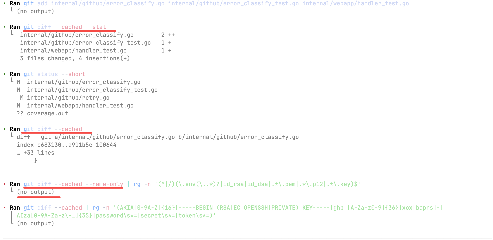
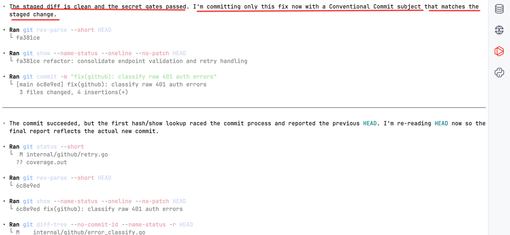
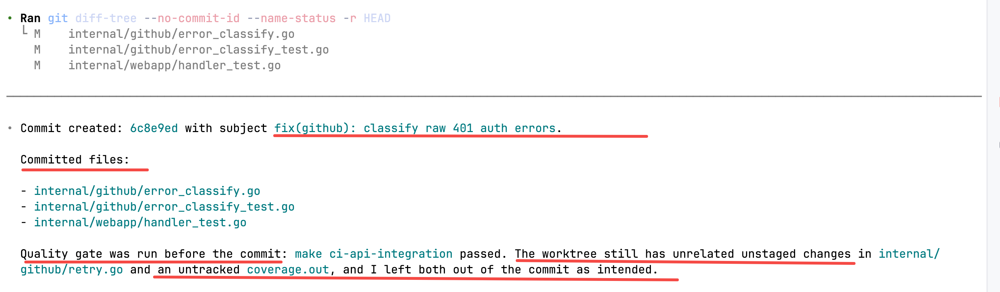
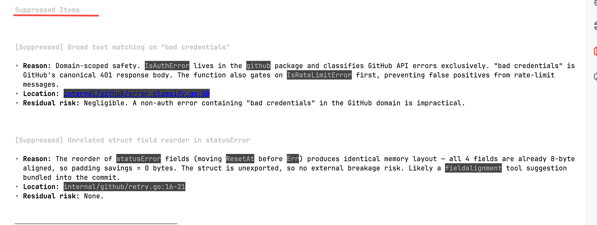

## 目录

6. [高质量 Skill 的设计模式](#6-skill)
   - [6.1 强制门禁架构（Mandatory Gates）](#61-mandatory-gates)
   - [6.2 反例教学（Anti-Examples）](#62-anti-examples)
   - [6.3 三级质量记分卡（Three-Tier Scorecard）](#63-three-tier-scorecard)
   - [6.4 黄金用例与合约测试（Golden Fixtures + Contract Tests）](#64-golden-fixtures-contract-tests)
   - [6.5 结构化输出契约（Structured Output Contract）](#65-structured-output-contract)
   - [6.6 版本与平台感知（Version/Platform Awareness）](#66-versionplatform-awareness)
   - [6.7 诚实降级（Honest Degradation）](#67-honest-degradation)
   - [6.8 自由度分级（Degrees of Freedom）](#68-degrees-of-freedom)
   - [6.9 五种执行编排模式（来自 Anthropic 官方指南）](#69-anthropic)
7. [常见陷阱与反模式](#7)
   - [7.1 Description 决定 Skill 的生死](#71-description-skill)
   - [7.2 SKILL.md 超过 500 行](#72-skillmd-500)
   - [7.3 Reference 文件没有加载条件](#73-reference)
   - [7.4 没有反例，只有正例](#74)
   - [7.5 忽视 `allowed-tools` 安全约束](#75-allowed-tools)
   - [7.6 动态上下文注入的误用与正用](#76)
   - [7.7 创建多余文件](#77)
   - [7.8 命名与安全硬限制](#78)
   - [7.9 性能与加载限制](#79)
   - [7.10 常见误解](#710)
8. [实战案例：从简单到复杂](#8)
   - [8.1 简单案例：git-commit](#81-git-commit)
   - [8.2 复杂案例：go-code-reviewer](#82-go-code-reviewer)
9. [设计哲学：从可传授到可执行](#9)
   - [9.1 知识的三种形态](#91)
   - [9.2 案例：git-commit skill 与Git规范的对齐](#92-git-commit-skill-git)
   - [9.3 同一哲学在不同 Skill 中的体现](#93-skill)
   - [9.4 三个关键能力](#94)
   - [9.5 三条设计原则](#95)

<a id="6-skill"></a>
## 6. 高质量 Skill 的设计模式

通过对 10 个高质量 的生产级 skill 的系统评审，提炼出 **8 个质量保障模式**（6.1–6.8）。此外，Anthropic 官方指南归纳了 **5 种执行编排模式**（6.9），两者正交互补——前者管"做得好不好"，后者管"怎么编排执行"。

| # | 模式 | 一句话 | 出现频率 |
|---|------|-------|---------|
| 6.1 | 强制门禁 | 不满足前置条件，不允许继续执行 | 9/10 |
| 6.2 | 反例教学 | 教 AI "什么不该做"比"该做什么"更有效 | 8/10 |
| 6.3 | 三级质量记分卡 | Critical 一票否决，防止低优先级问题稀释关键缺陷 | 7/10 |
| 6.4 | 黄金用例与合约测试 | 零 LLM 依赖的结构验证，确保 skill 不被意外破坏 | 9/10 |
| 6.5 | 结构化输出契约 | 固定输出字段，让 CI 流程可靠消费 AI 结果 | 10/10 |
| 6.6 | 版本与平台感知 | 根据项目实际版本过滤不适用的推荐 | 6/10 |
| 6.7 | 诚实降级 | 条件不完备时标记为部分结果，而非假装完整 | 5/10 |
| 6.8 | 自由度分级 | 脆弱操作给具体脚本，灵活操作给文本描述 | 官方指导 |

<a id="61-mandatory-gates"></a>
### 6.1 强制门禁架构（Mandatory Gates）

门禁是 skill 最核心的质量保障机制——**不满足前置条件，不允许继续执行**。门禁的数量和形态会随工作流复杂度变化：轻量如 `git-commit`，重型如 `create-pr`。

常见门禁类型：

| 门禁类型 | 作用 | 典型示例 |
|---------|------|---------|
| 执行完整性门禁 | 禁止声称运行了实际未运行的工具 | go-code-reviewer: "Never claim verification ran unless it actually did" |
| 上下文/证据门禁 | 收集必要信息后再行动 | security-review: 先扫描资源清单再评估 |
| 版本感知门禁 | 根据实际运行时版本调整行为 | unit-test: 读取 `go.mod` 版本，Go < 1.17 不推荐 `t.Setenv` |
| 降级输出门禁 | 条件不完备时标记输出为部分结果 | go-ci-workflow: 缺 Makefile 时标记 `# INLINE FALLBACK` |
| 适用性门禁 | 判断任务本身是否应该执行 | fuzzing-test: 不适合模糊测试的函数 → 直接停止 |

**设计要点**：门禁之间是**串行依赖**关系，任何一道不通过都阻断后续流程。这与传统的"检查清单"不同——清单可以跳过某项，门禁不行。

<a id="62-anti-examples"></a>
### 6.2 反例教学（Anti-Examples）

这是最反直觉的设计模式——**教 AI "什么不该做"比"该做什么"更有效**。原因是 LLM 天然倾向于过度报告（宁可多报不漏报），结构化的反例可以有效抑制假阳性。

以 `go-code-reviewer` 为例，它有 8 大类假阳性场景：

```markdown
## Anti-Examples — DO NOT Report

1. Speculative nil dereference with no evidence of actual nil source
2. Over-cautious error handling complaints where stdlib guarantees non-nil
3. False concurrency alarm on a map used only in a single goroutine
4. Premature optimization suggestion without profiling evidence
5. Version-inappropriate recommendation (e.g., slog for Go < 1.21)
6. Context over-propagation complaint when function already has ctx
7. Unnecessary abstraction suggestion for teaching/example code
8. Structural false alarm on intentional test fixtures
```

`unit-test` skill 同样有 10 条反例，如"不要测试标准库行为"、"不要为了覆盖率写只断言 `err == nil` 的用例"。

**设计要点**：反例要具体，不要写"避免误报"这种空话——要写清楚**什么场景下、什么样的输出是错误的**。BAD/GOOD 对照格式效果最佳。

<a id="63-three-tier-scorecard"></a>
### 6.3 三级质量记分卡（Three-Tier Scorecard）

将质量维度分为三级，用不同的通过标准防止"一票否决"和"均值稀释"：

| 层级 | 通过标准 | 典型示例 |
|------|---------|---------|
| **Critical** | 任何一项 FAIL → 整体 FAIL（一票否决） | 门禁存在性、安全扫描、killer case |
| **Standard** | ≥ 4/5 通过 | 测试覆盖、lint、格式化 |
| **Hygiene** | ≥ 3/4 通过 | 注释完整性、命名规范 |

这种分层防止了两种常见问题：低优先级问题"平均掉"关键缺陷，以及所有维度平权导致的决策瘫痪。

<a id="64-golden-fixtures-contract-tests"></a>
### 6.4 黄金用例与合约测试（Golden Fixtures + Contract Tests）

黄金用例是 skill 的"锚定测试"——为典型输入场景定义期望的规则覆盖和行为断言。合约测试验证 skill 文本的结构完整性。

测试体系通常包含：

- **合约测试**：验证 SKILL.md 中的门禁、reference 文件、输出字段是否齐全（不依赖 LLM，纯文本匹配）
- **黄金场景测试**：给定输入场景 X，验证 skill 文本中是否包含所有必需的规则关键词
- **回归脚本**：`scripts/run_regression.sh` 一键运行所有测试
- **覆盖率文档**：`COVERAGE.md` 记录测试覆盖范围和已知差距

10 个 skill 的测试数量统计：

| Skill | 合约测试 | 黄金场景测试 | 总计 |
|-------|---------|------------|------|
| tdd-workflow | 49 | 38 | 87 |
| fuzzing-test | 35 | 25 | 60 |
| go-ci-workflow | 44 | 17 | 61 |
| security-review | 30 | 25 | 55 |
| go-makefile-writer | 25 | 20 | 45 |
| unit-test | 24 | 17 | 41 |
| go-code-reviewer | 33 | 8 | 41 |

**关键特性**：所有测试零 LLM 依赖，运行时间 < 1 秒——这不是"用 AI 测试 AI"，而是纯粹的结构和规则验证。

#### 具体案例：go-code-reviewer 的 33 条合约测试与 8 个黄金用例

上面的表格显示 go-code-reviewer 有 33 条合约测试 + 8 个黄金用例。它们分别在验证什么？用三个案例说明。

**案例 1：合约测试 — 防止"方向相反的两条规则"被误删**

Go 中 HTTP Body 的关闭有一个经典的细微区别：服务端 handler 的 `r.Body` 由 `net/http` 框架自动关闭，不需要手动 `r.Body.Close()`；但客户端发起请求后的 `resp.Body` 必须手动关闭，否则连接泄漏。这意味着 SKILL.md 里必须**同时存在两条方向相反的规则**——漏掉任一条都会导致 AI 误报或漏报。

合约测试这样验证：

```python
def test_http_body_rule_is_server_client_aware(self):
    # 规则 1：服务端不需要手动关闭
    self.assertIn("avoid requiring explicit `r.Body.Close()`", self.skill_text)
    # 规则 2：客户端必须手动关闭
    self.assertIn("require `resp.Body.Close()`", self.skill_text)
    # 规则 3：reference 文件中的详细说明
    self.assertIn(
        "Do not treat missing `r.Body.Close()` in server handlers as an automatic defect.",
        self.api_ref_text,
    )
```

如果有人在迭代 SKILL.md 时不小心删除了服务端那条规则，这个测试立刻失败。**合约测试的价值在于：它防止的是"规则被误改或遗漏"，而非"AI 执行出错"**。

**案例 2：黄金用例（真阳性）— 验证 skill 能覆盖真实缺陷**

`001_race_shared_map.json` 定义了一个真实的并发 bug 场景：

```json
{
  "id": "GOLDEN-001",
  "title": "Race condition on shared package-level map",
  "expected_finding": true,
  "severity": "High",
  "category": "concurrency",
  "code": "package cache\n\nvar store = map[string]string{}\n\nfunc Set(k, v string) { store[k] = v }\nfunc Get(k string) string { return store[k] }\n// Both called from HTTP handlers (concurrent goroutines)",
  "coverage_rules": [
    "Race conditions on shared state (maps, slices, vars)",
    "concurrent map write"
  ]
}
```

测试逻辑：`expected_finding: true` 表示这个场景**应该产出 finding**。测试代码遍历 `coverage_rules` 数组，逐一检查 SKILL.md + reference 文件中是否包含这些关键词：

```python
def test_001_race_shared_map(self):
    f = self._load("001_race_shared_map.json")
    self.assertTrue(f["expected_finding"])
    # 验证 skill 文本中是否包含 "Race conditions on shared state"
    # 和 "concurrent map write" 这两条规则
    self._assert_coverage(f)
```

如果有人在重构 reference 文件时把"concurrent map write"相关段落删了，这个测试就会失败——提醒你：AI 将无法正确识别共享 map 的并发竞争。

**案例 3：黄金用例（假阳性抑制）— 验证 skill 不会误报**

`004_server_handler_body_fp.json` 和案例 1 的合约测试配合，但从另一个角度验证——**给定一段"正确的"代码，skill 中的规则是否足够让 AI 不误报**：

```json
{
  "id": "GOLDEN-004",
  "title": "Server handler without r.Body.Close — false positive",
  "expected_finding": false,
  "code": "func handler(w http.ResponseWriter, r *http.Request) {\n    data, err := io.ReadAll(r.Body)\n    // ...没有调用 r.Body.Close()\n}",
  "anti_example_patterns": [
    "avoid requiring explicit `r.Body.Close()`"
  ]
}
```

`expected_finding: false` 表示这个场景**不应该产出 finding**。测试检查 SKILL.md 中是否存在 `anti_example_patterns` 中列出的抑制规则。如果抑制规则被删除，测试失败——提醒你：AI 会对每个没有 `r.Body.Close()` 的 server handler 误报"资源泄漏"。

与之对照的是 `003_missing_resp_body_close.json`（`expected_finding: true`）——同样是 Body 没关闭，但场景是**客户端**代码，AI **应该**报错。这两个黄金用例像一对"阴阳对照"，共同确保 AI 在这个细微区别上不出错。

#### 合约测试 vs 黄金用例：两者的关系

| | 合约测试 | 黄金用例 |
|---|---|---|
| **验证粒度** | 单条规则是否存在 | 一个完整场景是否被规则覆盖 |
| **验证内容** | "SKILL.md 里有没有提到 `r.Body.Close()`" | "给一段没关 Body 的 server handler，规则是否足够让 AI 不误报" |
| **防护目标** | 防止规则被误删或改名 | 防止组合场景的覆盖缺失 |
| **类比** | 单元测试——验证每块砖都在 | 集成测试——验证砖块拼起来能盖住真实场景 |

简单说：**合约测试确保每块砖都在，黄金用例确保砖块拼起来能覆盖住真实场景**。两者结合，让 skill 在迭代过程中不会意外退化。

<a id="65-structured-output-contract"></a>
### 6.5 结构化输出契约（Structured Output Contract）

每个 skill 定义 7–10 个必输出字段，确保结果可审计、可解析、可集成到下游流程：

```markdown
## Output Contract (Mandatory Fields)

1. review_mode: Lite | Standard | Strict
2. files_reviewed: list of paths
3. findings: [{id, severity, category, location, description, evidence, recommendation}]
4. suppressed: [{reason, original_finding}]
5. baseline_comparison: {new, regressed, unchanged, resolved}
6. risk_summary: {overall_risk, sla_recommendations}
7. execution_status: {tools_run, tools_skipped, reason}
```

输出契约解决了 LLM 输出"自由发挥"的问题——**没有契约，每次输出格式都不同，无法被 CI 流程可靠消费**。

<a id="66-versionplatform-awareness"></a>
### 6.6 版本与平台感知（Version/Platform Awareness）

读取项目的实际版本信息，动态调整推荐内容：

```markdown
## Go Version Gate

Read go.mod → extract Go version → apply rules:
- < 1.17: do NOT recommend t.Setenv
- < 1.21: do NOT recommend slog
- < 1.22: WARN about range variable capture in goroutines
- < 1.24: do NOT recommend t.Parallel() + t.Setenv combination
```

这看似简单，却解决了 LLM 的一个高频错误：**推荐项目当前版本不支持的特性**。golangci-lint、SonarQube 等传统工具都没有这种"版本感知推荐过滤"能力。

<a id="67-honest-degradation"></a>
### 6.7 诚实降级（Honest Degradation）

当前置条件不完备时，skill 不是跳过检查或硬编码猜测，而是**生成显式标记的降级输出**：

```yaml
# go-ci-workflow 的降级策略：
# Level 1: Makefile 目标存在      → 完整一致性（Full Parity）
# Level 2: Makefile 存在但缺目标  → 部分一致性 + 补充建议
# Level 3: 无 Makefile            → 内联脚手架 + 每行标记 "# INLINE FALLBACK"
```

`create-pr` skill 也有类似设计：证据充分 → ready PR；证据不足 → draft PR + 标记 suspected 项。

**设计要点**：降级不是"做不好就不做"，而是**在做的同时明确告诉用户哪些部分是不完整的**。这比"假装一切正常"有价值得多。

<a id="68-degrees-of-freedom"></a>
### 6.8 自由度分级（Degrees of Freedom）

**来源**：skill-creator 官方指导

根据操作的脆弱程度，选择不同的指令精度：

| 自由度 | 表达方式 | 适用场景 |
|--------|---------|---------|
| **高** | 文本描述（"使用适当的错误处理"） | 有多种合理实现的场景 |
| **中** | 伪代码或参数化模板 | 有首选模式但允许变体 |
| **低** | 具体脚本或完整代码 | 脆弱/易出错的操作，必须精确执行 |

反例：把所有指令都写成"高自由度"的模糊描述，LLM 的输出质量会很不稳定；把所有指令都写成"低自由度"的具体脚本，则 skill 无法适应不同项目。

<a id="69-anthropic"></a>
### 6.9 五种执行编排模式（来自 Anthropic 官方指南）

前面 8 个设计模式聚焦于**质量保障**（门禁、反例、评分卡）。Anthropic 官方指南还归纳了 5 种描述 **skill 如何编排执行**的模式，两者正交互补：

| 模式 | 适用场景 | 核心技术 |
|------|---------|---------|
| **顺序工作流编排** | 必须按特定顺序执行的多步骤流程 | 显式步骤排序、步骤间依赖、逐阶段验证、失败时回滚指令 |
| **多 MCP 协调** | 跨多个服务的工作流（如 Figma→Drive→Linear→Slack） | 清晰的阶段分离、MCP 间数据传递、跨阶段前验证、集中式错误处理 |
| **迭代精化** | 输出质量随迭代提升的场景（如报告生成） | 初稿→质量检查→精化循环→最终化，含明确的质量标准和终止条件 |
| **上下文感知工具选择** | 同一目标但根据上下文选择不同工具 | 决策树、回退选项、向用户透明解释选择原因 |
| **领域专长注入** | skill 提供超越工具访问的专业知识 | 嵌入领域规则（如合规检查）、操作前门禁、审计追踪、治理记录 |

**实战对照**：`go-code-reviewer` 综合运用了"顺序工作流编排"（10 步串行门禁）、"上下文感知工具选择"（根据代码特征加载不同 reference）和"领域专长注入"（8 个领域的 2,100+ 行专家知识）。设计 skill 时，先确定适合哪种编排模式，再叠加质量保障模式。

---

<a id="7"></a>
## 7. 常见陷阱与反模式

<a id="71-description-skill"></a>
### 7.1 Description 决定 Skill 的生死

`description` 是 Claude 决定是否自动加载 skill 的**唯一依据**。Description 不在 SKILL.md 正文中——它在 frontmatter 里，且始终存在于上下文中。

常见错误：

```yaml
# BAD — 太模糊，Claude 无法判断何时加载
description: A helpful tool for Go developers.

# BAD — 只描述了是什么，没描述何时用
description: Go code review skill with multiple modes.

# GOOD — 包含触发条件和关键能力
description: >
  Review Go code changes for real defects (security, concurrency, error handling,
  resource leaks). Triggers on PR review, code review, diff analysis.
  Supports Lite/Standard/Strict modes. Evidence-based, false-positive-aware.
```

**规则**：所有"何时使用"的信息必须放在 description 中，而非正文中。正文解决"怎么做"，description 解决"什么时候做"。

<a id="72-skillmd-500"></a>
### 7.2 SKILL.md 超过 500 行

SKILL.md 的内容在 skill 触发时**全量加载到上下文**。超过 500 行不仅浪费 token，还会降低 Claude 对关键指令的关注度。

**拆分原则**：

- 决策框架、门禁、输出契约 → 留在 SKILL.md
- 具体领域知识、模板、检查清单 → 拆到 `references/`
- 确定性逻辑（扫描、验证） → 封装为 `scripts/`

<a id="73-reference"></a>
### 7.3 Reference 文件没有加载条件

仅列出文件名而不说明**什么时候加载**，Claude 可能全部加载（浪费 token）或一个都不加载（遗漏知识）：

```markdown
# BAD — 无加载条件
## References
- references/security-patterns.md
- references/concurrency-patterns.md
- references/performance-patterns.md

# GOOD — 明确触发条件
## References (Load Selectively)
- references/security-patterns.md
  Load when diff contains: database/sql, tls.Config, crypto/, jwt, bcrypt
- references/concurrency-patterns.md
  Load when diff contains: go func, chan, sync.Mutex, errgroup, context.WithCancel
- references/performance-patterns.md
  Load when diff contains: append(, sync.Pool, atomic., reflect.
```

<a id="74"></a>
### 7.4 没有反例，只有正例

只告诉 AI "找什么"不告诉它"什么不该报"，结果是假阳性泛滥。**尤其是审查类 skill，反例库的价值可能高于正例指南**。

<a id="75-allowed-tools"></a>
### 7.5 忽视 `allowed-tools` 安全约束

生产环境中运行的 skill（如 CI 中的 AI 代码审查）如果不限制工具权限，AI 可能执行意外操作：

```yaml
# BAD — 未限制工具，AI 可能 git push、删文件
- uses: anthropics/claude-code-action@v1
  with:
    prompt: "Review this PR"

# GOOD — 白名单 + 黑名单双重约束
- uses: anthropics/claude-code-action@v1
  with:
    prompt: "Review this PR following .claude/skills/go-code-reviewer/SKILL.md"
    allowed_tools: "Read,Grep,Glob,Bash(go test:*),Bash(golangci-lint:*)"
    disallowed_tools: "Bash(git add:*),Bash(git commit:*),Bash(git push:*)"
```

<a id="76"></a>
### 7.6 动态上下文注入的误用与正用

Skill 支持 `` !`command` `` 语法在加载前执行 shell 命令，输出替换占位符：

```markdown
# SKILL.md 中的动态上下文注入
当前 Go 版本：!`grep '^go ' go.mod | awk '{print $2}'`
当前分支：!`git branch --show-current`
```

这是**预处理**（在 skill 内容交给 Claude 之前执行），不是让 Claude 执行命令。适合注入项目元数据、版本号等确定性信息。

**误用**：把复杂逻辑写在 `` !`...` `` 中。复杂逻辑应封装为 `scripts/` 下的独立脚本。

<a id="77"></a>
### 7.7 创建多余文件

Skill 目录只需要必要文件。以下文件不应存在：

- `README.md`（SKILL.md 本身就是文档）
- `CHANGELOG.md`（用 git log）
- `INSTALLATION_GUIDE.md`（skill 不需要安装）
- `LICENSE`（跟随项目许可证）

<a id="78"></a>
### 7.8 命名与安全硬限制

以下是 Anthropic 强制执行的硬约束，违反会导致上传失败或静默忽略：

| 约束 | 要求 | 错误示例 |
|------|------|---------|
| 文件夹命名 | **必须 kebab-case** | `My_Cool_Skill` ❌、`mySkill` ❌、`my-skill` ✅ |
| SKILL.md 命名 | 大小写敏感，必须精确 | `skill.md` ❌、`SKILL.MD` ❌、`SKILL.md` ✅ |
| Skill 名称保留词 | 不允许包含 `claude` 或 `anthropic` | `claude-helper` ❌ |
| Description 内容 | 不允许 XML 角括号 `< >` | frontmatter 注入系统提示，角括号可能被解析为指令 |
| Description 长度 | ≤ 1024 字符 | — |

<a id="79"></a>
### 7.9 性能与加载限制

| 指标 | 建议值 | 说明 |
|------|--------|------|
| SKILL.md 大小 | **< 5,000 词**（约 500 行） | 超过此阈值，响应速度和输出质量均会下降 |
| 同时启用的 skill 数量 | **20-50 个** | 超过后 frontmatter 本身消耗大量上下文窗口 |
| Reference 文件 | 按需加载，不要全量内联 | 详细文档放 `references/`，在 SKILL.md 中设置加载条件 |

**进阶技巧（来自官方指南）**：对于关键验证逻辑，优先封装为 `scripts/` 下的可执行脚本，而非用自然语言描述——代码是确定性的，语言解释不是。参考 Anthropic 官方的 Office 系列 skill（docx, pptx, xlsx）了解此模式。

<a id="710"></a>
### 7.10 常见误解

| 误解 | 事实 |
|------|------|
| "Skill 就是更高级的 prompt" | Skill 是**可测试、可版本控制、按需加载的知识模块**。普通 prompt 无法被回归测试验证，无法按条件加载，无法在团队间共享。两者的关系类似于"临时脚本"和"正式工具"。 |
| "指令写得越详细，skill 越好" | 过度详细会导致两个问题：（1）超过 500 行时上下文成本过高；（2）低自由度指令无法适配不同项目。正确做法是区分自由度等级（见 6.8 节），对脆弱操作写具体脚本，对灵活操作给文本描述。 |
| "每个常用操作都应该做成 skill" | 只有满足三个条件才值得做 skill：会被反复使用、内容超过 50 行、不是每次会话都需要（见 3.1 节）。确定性操作（如格式化）用 Hook 更可靠，短规范直接放 CLAUDE.md 更高效。 |
| "Skill 写好了就不需要维护" | Skill 和代码一样会腐化——工具版本更新、团队规范变化、AI 模型行为变化都会让 skill 过时。需要通过合约测试持续验证，通过实战迭代持续改进（见第 9 章）。 |
| "Skill 只有开发者能写" | SKILL.md 本质是 Markdown 文件，PM 可以写流程类 skill（如发布检查清单），QA 可以写测试规范 skill，技术写作者可以写文档风格 skill。关键是理解"触发条件 + 操作步骤 + 输出要求"的基本结构。 |

---

<a id="8"></a>
## 8. 实战案例：从简单到复杂

<a id="81-git-commit"></a>
### 8.1 简单案例：git-commit

`git-commit` skill 只有 ~130 行 SKILL.md、无 references 目录，但实现了完整的安全提交流程：

**工作流程**：

```
预检 → 暂存策略 → 敏感信息扫描 → 质量门禁 → 生成 commit message → 提交 → 报告
```

**核心设计要点**：

1. **安全门禁**：用正则扫描 AWS 密钥、PEM 文件、GitHub Token 等敏感信息，发现即阻止提交
2. **质量门禁**：Go 项目自动运行 `go vet` + `go test`，非 Go 项目使用项目标准检查
3. **Hook 感知**：如果 git hook 拒绝了 commit，skill 会调整 message 以满足 hook 要求，而非绕过它
4. **原子性约束**："一次 commit = 一个逻辑变更"

**实战：在真实项目中执行 `$git-commit`**

以下三张截图取自 issue2md 项目的一次实际提交，展示门禁如何在每个阶段发挥作用：



**安全门禁**：暂存后、提交前，skill 用两道正则（文件名匹配 `.env`/`.pem`/`.key`，内容匹配 AWS 密钥/SSH 私钥/GitHub Token）扫描暂存区。截图中两道均 `(no output)` 表示通过。



**提交**：安全门禁通过后，skill 读取上一条 commit 的风格，生成 `fix(github): classify raw 401 auth errors`。注意它先确认了工作区中有无关的 `retry.go` 和 `coverage.out`，但**只暂存了目标修复的 3 个文件**——原子性约束在此体现。



**报告**：结构化输出 commit hash + 文件清单 + 质量门禁结果（`make ci-api-integration passed`），并明确标注未提交的无关变更。这条 commit 将在 §12.2 中触发 CI 流水线全绿。

即使是这样一个简单的 skill，也包含了门禁（gate）的设计——这是所有高质量 skill 的共同特征。而它更深层的价值——如何将团队的 Git 规范文档转化为可执行的门禁——将在第 9 章详细展开。

<a id="82-go-code-reviewer"></a>
### 8.2 复杂案例：go-code-reviewer

`go-code-reviewer` 是评分 9.5/10 的复杂 skill，~3,100 行，包含 SKILL.md + 8 个 reference 文件 + 33 个合约测试 + 8 个黄金用例。它展示了一个成熟 skill 的完整架构。

**三级执行模式**：

| 模式 | 适用场景 | Finding 上限 |
|------|---------|-------------|
| Lite | ≤3 文件、低风险 | 5 |
| Standard | 默认 | 10 |
| Strict | 安全/并发/API 契约变更 | 15 |

**7 道强制门禁**：

```
Execution Integrity → Baseline Comparison → False-Positive Suppression
→ Risk Acceptance/SLA → Go Version → Generated Code Exclusion → Reference Loading
```

其中三个是独创设计：

- **Go Version Gate**：读取 `go.mod` 中的 Go 版本，阻止推荐项目不可用的特性（如 Go 1.20 项目不推荐 `slog`）。golangci-lint、SonarQube 均无此能力。
- **Reference Loading Gate**：当代码匹配触发模式时，**强制**加载对应的领域参考文档。不是"建议参考"，而是"不加载不允许评审"。
- **反例库**：8 大类假阳性场景。教会 Claude **什么不该报**——比"该找什么"更难，也更有价值。

**反例教学的实际效果：**



上图取自对同一个 `fix(github)` 提交的真实审查输出。skill 自动抑制了两个假阳性：（1）`isAuthError` 中的 "bad credentials" 字符串匹配——因为它限定在 GitHub API 域内，不构成安全风险；（2）`statusError` 的字段重排——因为 4 个字段已经是 8 字节对齐，内存布局不变。每个抑制项都附带**具体的领域推理和残余风险评估**，而非简单地"跳过"。这正是 §6.2 中反例教学模式的实战效果。

**渐进式披露实践**：

```
SKILL.md（457 行操作框架）
   └── 根据代码中的触发关键字，按需加载：
       ├── go-security-patterns.md（581 行，触发词：database/sql, tls.Config, jwt...）
       ├── go-concurrency-patterns.md（224 行，触发词：go func, chan, sync.Mutex...）
       ├── go-error-and-quality.md（249 行，触发词：_ =, panic(, errors.Is...）
       ├── go-test-quality.md（174 行，触发词：_test.go 文件在 diff 中）
       ├── go-api-http-checklist.md（222 行，触发词：net/http, gin., grpc...）
       ├── go-performance-patterns.md（287 行，触发词：append(, sync.Pool, atomic....）
       ├── go-modern-practices.md（296 行，触发词：[T, slog., atomic.Int...）
       └── pr-review-quick-checklist.md（65 行，触发词：任何 PR/diff 审查）
```

审查一个只涉及 HTTP handler 的 PR 时，只加载 `go-api-http-checklist.md` 和 `pr-review-quick-checklist.md`，而非全部 2,100 行——这就是渐进式披露的实际效果。

---

<a id="9"></a>
## 9. 设计哲学：从可传授到可执行

前面的章节从技术层面讲解了 skill 的写法、设计模式和迭代方法。但经过大量的 skill 编写和实战迭代，我逐渐认识到一个更本质的问题——**skill 不只是 AI 编程助手的定制化手段，它代表了一种工程哲学的转变：把人的经验从"可传授"变成"可执行"**。

<a id="91"></a>
### 9.1 知识的三种形态

在任何技术团队中，工程实践以三种形态存在：

```
隐性知识            显性知识            可执行知识
(在人脑中)          (在文档中)          (在 Skill 中)
┌──────────┐      ┌──────────┐      ┌──────────┐
│ "提交前要 │ ──→  │ Git 规范  │ ──→  │ git-     │
│  检查密钥" │ 文档化 │ 第6章§2  │ Skill化 │ commit   │
│ "message  │      │ Commit   │      │ SKILL.md │
│  要写why" │      │ 规范细则  │      │ 7步工作流 │
└──────────┘      └──────────┘      └──────────┘
  ✗ 依赖记忆          ✗ 依赖阅读          ✓ 自动执行
  ✗ 不可验证          ✗ 不可强制          ✓ 门禁强制
  ✗ 随人员流失        ✓ 可沉淀            ✓ 可沉淀+可复用
```

传统做法止步于第二阶段——写文档、做培训、靠 Code Review 传承。这条链路的根本问题在于：**知识的执行完全依赖人的自律和记忆**。文档写得再好，忘了看就等于不存在。

Skill 补上了从第二阶段到第三阶段的关键一步：**把显性知识自动化**。

<a id="92-git-commit-skill-git"></a>
### 9.2 案例：git-commit skill 与Git规范的对齐

`git-commit` skill（§8.1）是这一哲学最直观的实证。比如我们团队的git操作指南 在第 2 章《日常操作命令详解》和第 6 章《工作流与提交规范》中沉
淀了完整的 Git 提交规范，skill 将其中与提交相关的规范逐条转化为 7 步工作流中的强制门禁：

参考：[`xrdy511623/go-notes`](https://github.com/xrdy511623/go-notes) /`productivetools/git`

| Git 规范主题 | 当前文档主题 | Skill 对齐状态 |
|-------------|-------------|---------------|
| 原子性提交：一次 commit 只做一件事 | 提交粒度与分块暂存实践 | ✅ Hard Rule + `git add -p` 默认策略 |
| 描述"为什么"而非"做了什么" | 提交信息的 body 写法 | ✅ body 必须回答 "why it changed" |
| 遵循团队 commit 规范 | 提交消息约定 | ✅ Conventional Commits 全套规则 |
| Conventional Commits 格式 | 标题格式规范 | ✅ type(scope): subject 完全一致 |
| type 类型覆盖 | 类型约定与例外处理 | ✅ 超集（额外 +build/revert） |
| subject ≤ 50 字符 | 标题长度约束 | ✅ 与 GitHub 截断阈值对齐 |
| body 解释"为什么改" | 正文职责边界 | ✅ what vs why 职责分离 |
| footer 规范 | footer / issue 关联规范 | ✅ BREAKING CHANGE + Closes # + Refs: |
| `--amend` 安全警告 | 历史改写与 force push 风险 | ✅ 含已 push 场景的 force push 风险提示 |

9 条规范全部覆盖，从原子性提交到 footer 格式，从 subject 长度限制到 `--amend` 安全警告，无一遗漏。关键转变不在于 skill 重复了文档的内容，而在于它改变了知识的**执行方式**：从"请查阅 Git 规范"变成了"不符合规范就不允许提交"。

<a id="93-skill"></a>
### 9.3 同一哲学在不同 Skill 中的体现

这一模式贯穿了所有的高质量 skill：

| Skill | 隐性知识（原本在人脑中）                  | 显性知识（文档化） | 可执行知识（Skill 化） |
|-------|-------------------------------|------------------|---------------------|
| go-code-reviewer | 资深工程师的审查直觉：安全模式、并发陷阱、性能反模式    | 8 个领域参考文档，共 2,100+ 行 | 触发关键字自动加载对应领域文档，强制门禁串行执行 |
| unit-test | "测试应该发现 bug，不是追求覆盖率"          | Defect-First Workflow 方法论文档 | 写测试前必须先产出失败假设清单，每个目标必含 Killer Case |
| go-makefile-writer | 团队构建规范：lint、test、fmt 的标准目标和参数 | 项目 Makefile 约定文档 | 生成符合团队规范的 Makefile，CI 直接基于此执行质量门禁 |
| security-review | 生产事故中积累的安全经验（如数据库连接泄漏）        | 安全检查清单 | 强制审查资源生命周期管理，构造器-释放器配对检查 |

<a id="94"></a>
### 9.4 三个关键能力

把经验从"可传授"变成"可执行"，需要三个能力的结合：

1. **识别隐性知识**——意识到团队中哪些"大家都知道"的规则其实只存在于少数人脑中。比如"提交前要检查有没有误提密钥"，在出事之前没有人觉得需要写下来。

2. **结构化表达**——把模糊的经验转化为精确的规则、门禁和工作流。"代码审查要仔细"是不可执行的；"匹配到 `database/sql` 时强制加载安全审查文档，检查连接池配置和事务边界"才是可执行的。

3. **选择正确的自动化粒度**——不是所有知识都适合自动化。确定性高的规则（格式规范、安全扫描、资源生命周期检查）交给 skill 强制执行；需要灵活判断的决策（架构选型、业务逻辑合理性）留给人。过度自动化和不自动化一样有害。

<a id="95"></a>
### 9.5 三条设计原则

Anthropic 官方指南将以下三条原则列为 skill 的核心设计原则，它们共同支撑上述哲学的落地：

| 原则 | 含义 | 实践指导 |
|------|------|---------|
| **渐进式披露** | 三级加载——frontmatter 始终可见、SKILL.md 按需加载、references/ 按需发现 | 不要把所有内容塞进 SKILL.md，详细文档放 references/（见 §5） |
| **可组合性** | Claude 可同时加载多个 skill，你的 skill 应与其他 skill 和谐共存 | 避免假设独占工具访问权，输出字段不要与通用 skill 冲突，保持职责边界清晰 |
| **可移植性** | 同一 skill 无需修改即可在 Claude.ai、Claude Code 和 API 上运行 | 不要依赖特定平台的文件路径或环境变量，在 `compatibility` 字段声明必要的运行时依赖 |

"渐进式披露"在 §5 已有详细讲解。"可组合性"和"可移植性"是此次补充的重点——它们决定了 skill 能否在团队环境和多平台部署中真正发挥价值。如果一个 skill 假设自己是唯一活跃的 skill，或者只能在某个特定平台上工作，它的复用价值将大打折扣。

这不是工具使用能力的问题，而是一种**工程思维的升级**。在 AI 时代，能完成这一转变的人和团队，将持续拥有竞争优势。

---
