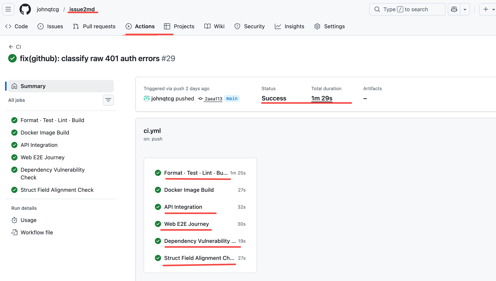

## 目录

12. [将 Skill 融入开发流程](#12-skill)
   - [12.1 本地开发：Makefile 驱动的质量门禁](#121-makefile)
   - [12.2 CI 流程：Skill 驱动的自动化门禁](#122-ci-skill)
   - [12.3 代码审查：AI 驱动的 PR Review](#123-ai-pr-review)
   - [12.4 完整的质量管线](#124)
13. [Skill 与其他 Claude Code 特性的关系](#13-skill-claude-code)
   - [13.1 特性对比](#131)
   - [13.2 选择决策树](#132)
   - [13.3 组合使用模式](#133)
   - [13.4 一句话总结](#134)
14. [AI 编程助手定制能力横向对比](#14-ai)
   - [14.1 主流工具定制能力对比](#141)
   - [14.2 AI 代码审查工具对比](#142-ai)
   - [14.3 趋势判断](#143)


## 12. 将 Skill 融入开发流程

Skill 的真正价值不是孤立使用，而是串联到开发流程的关键节点，形成**质量管线**。

### 12.1 本地开发：Makefile 驱动的质量门禁

`go-makefile-writer` skill 帮我们为 Go 项目生成标准化的 Makefile。核心理念：**开发者在 push 之前就应该能捕获 CI 会发现的所有问题**。

以 [issue2md](https://github.com/johnqtcg/issue2md) 项目为例，Makefile 中的 `ci` 目标直接镜像 CI 流程：

```makefile
ci: fmt-check ci-core  ## Local/CI required gate parity checks

ci-core: cover-check lint build-all  ## Run coverage gate, lint, build
```

本地执行 `make ci` 和 CI 执行 `make ci COVER_MIN=80` 是**同一条命令**——这就是 go-ci-workflow skill 所说的 "Local Parity"（本地一致性）。

### 12.2 CI 流程：Skill 驱动的自动化门禁

CI workflow 是 Makefile 目标的薄封装层。以下以 issue2md 项目为例（需根据自己的项目适配工具版本和目标名称）：

```yaml
# .github/workflows/ci.yml（示例，需适配）
jobs:
  ci:
    steps:
      - name: Install golangci-lint
        run: go install github.com/golangci/golangci-lint/v2/cmd/golangci-lint@v2.6.2
      - name: Run CI gate
        run: make ci COVER_MIN=80

  docker-build:
    steps:
      - name: Build image
        run: make docker-build
```

每个 CI job 委托给一个 Makefile 目标。开发者在本地跑 `make ci`，CI 也跑 `make ci`——流程完全一致。



这次 CI 正是由 §8.1 中 `git-commit` skill 的提交触发的——从本地门禁到 CI 全绿，整条链路由 skill 驱动。

### 12.3 代码审查：AI 驱动的 PR Review

`go-code-reviewer` skill 可以集成到 CI 中，对每个 PR 自动执行代码审查。以下以 tcg-ucs 项目为例（需根据自己的项目适配 skill 路径、prompt 内容和工具权限）：

```yaml
# .github/workflows/claude-code-review.yml（示例，需适配）
name: Claude Code Review
on:
  pull_request:
    branches: [master, main]
    types: [opened, synchronize]

jobs:
  review:
    steps:
      - uses: anthropics/claude-code-action@v1.0.3
        with:
          prompt: |
            Read .claude/skills/go-code-reviewer/SKILL.md,
            get the PR diff via `gh pr diff`,
            select review mode (Lite/Standard/Strict),
            execute the full review workflow,
            post findings as PR comments.
```

工作流 YAML 只做编排，**所有审查逻辑都在 skill 中**。更新审查标准只需更新 skill 文件，无需修改 CI 配置。

### 12.4 完整的质量管线

把上述环节串联起来，形成从编码到合并的完整质量管线：

```
编码
  ↓
make fmt / make lint（本地质量检查，go-makefile-writer 生成）
  ↓
git commit（git-commit skill：安全扫描 + 质量门禁 + 规范化 message）
  ↓
git push
  ↓
create PR（create-pr skill：8 道门禁 + 结构化 PR body）
  ↓
CI 触发
  ├── make ci（格式 + 测试 + lint + 覆盖率 + 构建）
  ├── make docker-build（容器镜像验证）
  ├── Claude Code Review（go-code-reviewer skill：自动代码审查）
  └── govulncheck（依赖漏洞扫描）
  ↓
人工审查 + 合并
```

每个环节都有对应的 skill 提供保障，且本地和 CI 保持一致。

---

## 13. Skill 与其他 Claude Code 特性的关系

Claude Code 提供了多种扩展机制，各有其适用场景。理解它们的区别是正确使用的前提。

### 13.1 特性对比

| 特性 | 加载时机 | 最佳用途 | 上下文成本 |
|------|---------|---------|-----------|
| **CLAUDE.md** | 每次会话自动加载 | 项目通用规范：代码风格、commit 规范、技术栈说明、构建命令 | 每次请求都消耗 |
| **Rules**（`.claude/rules/`） | 每次会话或匹配文件时 | 按文件类型/目录的细粒度规范 | 条件性消耗 |
| **Skill** | 按需加载（描述始终在上下文，正文仅在使用时加载） | 可复用的领域知识和工作流 | 低（不用不消耗） |
| **Sub-agent** | 被调度时 | 隔离的并行子任务，避免撑爆主会话上下文 | 独立上下文，不影响主会话 |
| **MCP** | 会话启动时 | 连接外部服务（GitHub API、Google 邮箱、数据库） | 每次请求消耗 |
| **Hook** | 事件触发时 | 确定性自动化：提交前格式化、保存时 lint | 零（不进入 AI 上下文） |
| **自定义斜杠命令** | 用户输入 `/` 时 | 已被 skill 吸收，`.claude/commands/` 仍兼容 | 同 skill |

### 13.2 选择决策树

```
这个知识/流程需要在每次会话中生效吗？
├── 是 → 它短于 200 行吗？
│   ├── 是 → 放在 CLAUDE.md
│   └── 否 → 拆分到 .claude/rules/ 或抽取为 skill
├── 否 → 它需要用户主动触发吗？
│   ├── 是 → 它有副作用吗？
│   │   ├── 是 → Skill + disable-model-invocation: true
│   │   └── 否 → Skill（默认）
│   └── 否 → 它是确定性逻辑（如格式化、lint）吗？
│       ├── 是 → Hook（零 AI 上下文成本）
│       └── 否 → 它需要连接外部服务吗？
│           ├── 是 → MCP server
│           └── 否 → Skill + user-invocable: false（后台知识）
```

### 13.3 组合使用模式

这些特性不是互斥的，最佳实践是组合使用：

| 组合 | 效果 |
|------|------|
| **CLAUDE.md + Skill** | CLAUDE.md 定义全局规范（commit 格式、日志规范），skill 提供具体工作流（git-commit 如何执行） |
| **Skill + Sub-agent** | skill 中设置 `context: fork`，在隔离上下文中运行复杂分析，避免撑爆主会话 |
| **Skill + MCP** | skill 定义操作流程，MCP 提供外部工具（如 skill 定义 PR 创建流程，MCP 连接 GitHub API） |
| **Skill + Hook** | skill 定义代码审查标准，hook 在 `git commit` 前自动运行格式化和静态检查 |
| **Skill + Skill** | skill 之间交叉引用（如 go-ci-workflow 引用 `$go-makefile-writer` 来修复缺失的 Makefile 目标） |

### 13.4 一句话总结

> **CLAUDE.md 是"始终生效的背景知识"，Skill 是"按需加载的专业能力"，Hook 是"零成本的确定性保障"，MCP 是"连接外部世界的桥梁"，Sub-agent 是"隔离执行的并行agent"。**

把对的知识放在对的位置，既保证了 AI 在关键时刻拥有必要的上下文，又避免了无关信息对上下文窗口的浪费。

---

## 14. AI 编程助手定制能力横向对比

Skill 并非唯一的 AI 编程助手定制机制。了解市场上其他工具的定制能力，有助于理解 skill 的设计理念和独特优势。

### 14.1 主流工具定制能力对比

| 能力维度 | Claude Code (Skill) | Cursor (Rules) | GitHub Copilot | Windsurf |
|---------|-------------------|----------------|---------------|----------|
| 配置文件 | CLAUDE.md + `.claude/rules/` + Skill | `.cursor/rules/` | `.github/copilot-instructions.md` | `.windsurfrules` |
| 按需加载 | 支持（description 触发 + 选择性 reference） | 支持（glob 模式匹配） | 不支持 | 不支持 |
| 可调用工作流 | 支持（`/skill-name` + 参数传递） | 有限 | 不支持 | 不支持 |
| 子代理隔离 | 支持（`context: fork`） | 不支持 | 不支持 | 不支持 |
| 动态上下文注入 | 支持（`` !`command` `` 预处理） | 不支持 | 不支持 | 不支持 |
| 脚本封装 | 支持（`scripts/` 目录） | 不支持 | 不支持 | 不支持 |
| 工具权限控制 | 支持（`allowed-tools` 白名单） | 不支持 | 不支持 | 不支持 |
| 跨工具互操作 | 支持（Agent Skills 开放标准） | 不支持 | 不支持 | 不支持 |
| 分发机制 | 企业/个人/项目/插件 四级 | 项目级 | 项目级 | 项目级 |

### 14.2 AI 代码审查工具对比

在 CI 集成的代码审查领域，也有多种选择：

| 工具 | 渗透率 | 定制深度 | 典型用法 |
|------|--------|---------|---------|
| **GitHub Copilot Code Review** | 6000 万+ 次审查，12000+ 组织 | 低（通过 `.github/copilot-instructions.md` 定制） | 开箱即用，覆盖 GitHub 20%+ 的代码审查 |
| **CodeRabbit** | 200 万仓库，10000+ 付费客户 | 中（YAML 配置 + 规则） | 安装 GitHub App 即可使用 |
| **Claude Code + 自定义 Skill** | 早期采用阶段 | 高（完整的门禁/反例/渐进式披露体系） | 需要工程投入，但定制深度和审查质量上限最高 |

Copilot 和 CodeRabbit 胜在**开箱即用和规模**；Claude Code + Skill 胜在**定制深度和领域适配**。对于有特定领域审查需求（如 Go 并发安全、资源生命周期管理）的团队，后者的投入产出比更高。

### 14.3 趋势判断

AI 代码审查已经从"新鲜事物"变成"基础设施"——Copilot Code Review 覆盖了 GitHub 20% 以上的代码审查量。但在**定制化深度**上，行业仍处于早期：

- **大多数团队**：直接使用 Copilot 或 CodeRabbit 的默认配置，不做深度定制
- **进阶团队**：通过配置文件传递项目级规范（如 `.github/copilot-instructions.md`）
- **前沿实践**：用自定义 skill 构建完整的领域审查体系（门禁、反例、版本感知、降级策略）

从"能用 AI"到"用好 AI"，中间隔着的正是本文讨论的这些设计模式和工程实践。

---
