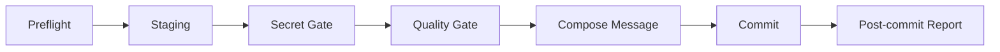

# git-commit Skill Design Rationale

`git-commit` is a safety workflow that turns the act of committing into an engineering process. Its core idea is: **a commit is a quality gate that should pass preflight checks, staging review, secret scanning, quality verification, and result reporting before it goes through.** That is why it uses a seven-step serial workflow instead of a bare `git add` + `git commit`.

## 1. Definition

`git-commit` is a safety-enhanced commit skill. Before executing a commit, it validates repository state, identifies the staging scope, scans for secrets, runs an ecosystem-matched quality gate, generates an Angular / Conventional Commits message in English, and outputs a structured post-commit report.

## 2. Background and Problems

The skill is not solving "developers don't know how to write a commit message." It is solving "teams treat committing as a throwaway action."

Without guardrails, failures tend to cluster into five categories:

| Problem | Typical consequence |
|---------|---------------------|
| Committing while the repository is in a bad state | Conflicts, a rebase mid-state, or a detached HEAD end up in the commit |
| Staging scope out of control | Unrelated changes, temp files, and submodule pointer updates sneak into the commit |
| Secrets not caught | API keys, private keys, and database URIs land in version history |
| No quality checks before committing | Broken changes reach the main branch without tests, lint, or vet ever running |
| Message looks correct but the semantics are wrong | Invented scopes, overly long subjects, multiple intents packed into one commit |

The design philosophy is to move these common failure points forward as mandatory gates, each with clearly defined inputs, pass/fail conditions, and a clean failure exit.

## 3. Comparison with Common Alternatives

Before diving into the design, a quick high-level comparison helps establish what gap the skill fills:

| Dimension | `git-commit` skill | Plain `git add && git commit` | commitlint / hook only |
|-----------|--------------------|-------------------------------|------------------------|
| Preflight checks | Strong | Weak | Weak |
| Staging scope control | Strong | Weak | Weak |
| Secret scanning | Strong | Manual | Medium |
| Multi-ecosystem quality gates | Strong | Often skipped | Medium |
| Message convention | Strong | Inconsistent | Strong |
| Handling mixed-intent commits | Strong | Weak | Weak |
| Post-commit receipt | Strong | Weak | Weak |

The skill is not a replacement for hooks. It fills the layer that comes *before* hooks — the structured, interactive commit decision process that hooks alone cannot provide.

## 4. Core Design Rationale

### 4.1 Seven Steps in Series

The main workflow is:

The order is not arbitrary. It follows a strict principle: the cheaper, the more foundational, the earlier it runs.

1. `Preflight` checks whether the repository is in a committable state.
2. `Staging` clarifies what is actually going into this commit.
3. `Secret Gate` intercepts high-risk content before any quality checks run.
4. `Quality Gate` validates only the content that is already confirmed for commit.
5. `Compose Message` runs last, because the message must be grounded in known scope, known intent, and known check results.
6. `Post-commit Report` ensures the workflow has a complete ending, not just a silent success.

This ordering solves two practical problems:

- Prevents wasted effort on the wrong object. If the repository is mid-rebase, there is no point discussing the message.
- Prevents after-the-fact fixes. Discovering a leaked secret after committing is far more costly than catching it before.

### 4.2 Preflight Is a Hard Gate

`git-commit` checks for conflicts, detached HEAD, and mid-operation states (rebase, merge, cherry-pick, revert) right at the start. The underlying insight is: **most commit accidents are not caused by bad code content — they are caused by bad repository context.**

The value of these checks is threefold:

- They are cheap — a handful of deterministic Git commands.
- A single failure makes every subsequent step meaningless.
- They significantly reduce the chance of mistaking a mid-operation Git state for a clean working tree.

Preflight is not a nice-to-have. It is a commit eligibility check.

### 4.3 Staging Is Its Own Layer

Most commit tools assume the user has already staged the right things. `git-commit` rejects this assumption and treats staging analysis as a distinct, non-trivial problem.

Four important design decisions here:

| Decision | Reasoning |
|----------|-----------|
| More than 8 changed files → always list all files and ask for confirmation | The more files there are, the easier it is to miss details and accidentally include the wrong ones |
| Group changes by logical intent, not by file list | A good commit unit is "one logical intent," not "a set of files" |
| Use `git add -p` when a single file contains multiple intents | Prevents staging granularity from being too coarse |
| Stash unstaged changes with `--keep-index` before running the quality gate | Ensures the gate validates what will actually be committed, without discarding local work |

**On the eight-file threshold:** the number is not arbitrary. Cognitive science research on working memory (Miller's Law) shows that error rates rise significantly when a person tracks more than 7±2 objects simultaneously. Past eight changed files, reliably reviewing each file's intent by hand becomes difficult. Fixing the threshold at 8 gives the confirmation prompt a clear, predictable trigger — it becomes a reliable safety net rather than something the model decides on a case-by-case basis.

The standout detail here is `stash --keep-index`. It reflects mature engineering judgment: **pre-commit tests should validate what is about to be committed, not a working tree that still contains unstaged changes mixed in.**

### 4.4 Secret Scanning Uses Regex Plus Layered Triage

Manual diff review misses tokens, private keys, and connection strings. Broad regexes catch everything but generate too many false positives. `git-commit` does not choose between these two approaches — it combines them:

1. Cast a wide net using filename and content regexes to capture as many suspicious matches as possible.
2. Filter through four ordered rule layers: allowlist, test data files, documentation, comments.
3. Only matches that survive all four filters actually block the commit.

This design balances security against usability:

- Scanning without triage buries users in false positives and they stop trusting the tool.
- Triage without scanning lets genuinely dangerous content slip through unnoticed.

The filter order is fixed as "first hit decides." Results are deterministic — they do not vary based on how the model interprets each specific situation.

### 4.5 Quality Gates Are Split into Reference Files

`git-commit` does not stuff Go, Node, Python, Java, and Rust quality checks into the main skill file. They live in separate `references/quality-gate-*.md` files instead.

This is a deliberate tradeoff with three benefits:

| Goal | Benefit |
|------|---------|
| Keep the main skill small | The main file stays focused on the universal commit workflow |
| Load on demand | Only the gate for the current ecosystem gets loaded |
| Independent maintenance | Each language gate can evolve without touching the main workflow |

More importantly, the decision of *which gate to run* is not left to the model's judgment. The skill provides deterministic rules: check the extension distribution of staged files, break ties using the ecosystem marker file closest to the repository root. The goal is not cleverness — it is reproducibility.

### 4.6 Message Generation Is Strictly Constrained

The skill enforces two hard constraints on the commit message:

- Total subject length must be ≤ 50 characters.
- A scope may only appear if it has already been established in the commit history — otherwise, omit it entirely.

Each constraint addresses a distinct common failure:

| Constraint | Problem it solves |
|------------|-------------------|
| ≤ 50 characters | Prevents the subject from becoming a compressed summary paragraph |
| No invented scopes | Prevents messages that look structured but actually introduce incorrect taxonomy |

The no-invented-scope rule deserves emphasis. Many tools encourage the model to always fill in a scope. `git-commit` requires the model to mine scope frequency from recent history before deciding whether to use one at all. This is a deliberate rejection of fake-structured output.

The April 2026 revision tightens this further in two places:

- **Bootstrap scope only for young repositories**: if the repository has fewer than 10 conventional commits total, the skill may infer a scope from the deepest stable staged directory after stripping generic path segments such as `src`, `pkg`, `internal`, `service`, `services`, `module`, `package`, `component`, and `testdata`. This fixes the "new repo can never establish a scope" failure mode without allowing free-form scope invention in mature repositories.
- **Executable subject guard**: the skill now requires a shell-level length and trailing-period check before `git commit` runs. The 50-character limit is therefore enforced by a concrete command path, not by model self-discipline alone.

### 4.6.1 Timeout Overrides Are Explicit

The original 120-second timeout rule was intentionally conservative, but it was too rigid for large Java and multi-module builds. The skill now treats timeout as a deterministic setting with a default and an override chain:

- Default: 120 seconds with no output.
- Override sources: repository wrapper configuration (`COMMIT_TEST_TIMEOUT`) or environment (`QUALITY_GATE_TIMEOUT_SECONDS`, `SKILL_QUALITY_GATE_TIMEOUT_SECONDS`).
- Operational rule: report the chosen timeout before starting the long-running quality gate.

This keeps the safety property ("do not hang forever") while removing the false-negative failure mode where a healthy but slow build looks like a gate failure.

### 4.7 There Is a Post-Commit Report

Many workflows treat a successful `git commit` as the finish line. `git-commit` does not. It requires a post-commit output that includes the short hash, final subject, a summary of changed files, and gate status.

This adds three concrete values:

- The user can immediately confirm what was just committed.
- Quality gate outcomes are recorded, not just shown in passing during the run.
- The report provides consistent input for subsequent PR creation, review, and audit.

The skill cares not just about executing the commit, but about whether the whole workflow reached a proper conclusion.

### 4.8 `--no-verify` Is Disallowed After a Hook Rejection

Step 6 has an explicit rule: if a Git hook (commitlint, pre-commit, husky, lefthook, etc.) rejects the commit, the message must be read and adapted to satisfy the hook. Using `--no-verify` to bypass it is not an option unless the user explicitly requests it.

The reasoning: **hooks are the team's compliance layer, not noise in an individual workflow.**

- Hooks in a project typically encode deliberate team or organization rules — an allowed scope list, a required ticket ID format, a ban on WIP commit types. Bypassing them with `--no-verify` is a unilateral declaration that one's own commit is exempt from the team's standards.
- A hook rejection is information: it tells you the message does not meet the agreed convention. The correct response is to fix the message, not to silence the feedback.
- Allowing AI tools to default to `--no-verify` creates a destructive cycle: the team spends effort configuring compliance hooks, and the AI tool quietly bypasses them.

The skill's response to a rejection is to report the hook name and error, adapt the message accordingly, and log what was changed. This resolves the immediate problem while keeping the hook's enforcement intact. The only exception is an explicit user instruction to skip — at that point, the skip is logged and the decision is returned to the user rather than made by the tool.

## 5. Problems This Design Addresses

Cross-referencing `SKILL.md` and the evaluation report, the skill targets these concrete engineering problems:

| Problem | Corresponding design | Practical effect |
|---------|----------------------|------------------|
| Bad repository state | Preflight hard gates | Stops on conflict, rebase, or detached HEAD before anything else runs |
| Staging scope drift | Intent-based grouping, 8-file threshold, `git add -p` | Reduces mixed-intent and accidental commits |
| Secret exposure | Filename scan + content scan + triage | Higher detection rate with fewer false positives |
| Skipped quality checks | Ecosystem-aware quality gate | Tests, lint, and vet run before every commit |
| Distorted commit messages | History-based scope discovery, length limit, imperative mood | More consistent and readable commit history |
| Bypassing team standards | Refusing default `--no-verify`, requiring error-based adjustment | Keeps hook compliance layer fully effective |
| No audit trail | Post-commit report | Every commit leaves a structured receipt |

The evaluation data backs this up: `git-commit` passed all 35 assertions across 3 test scenarios (100%), while the same scenarios without the skill had a strict pass rate of only 23%. The April 2026 regression expansion adds 7 golden fixtures for message composition, scope bootstrap, and timeout override behavior. The value is not prettier formatting — it is a significant reduction in steps that get skipped in real workflows.

## 6. Key Highlights

### 6.1 Elevating a Commit from a Command to a Quality Gate

This is the skill's most important contribution. It reframes a commit not as a mechanical command but as the last local checkpoint before code enters version history.

### 6.2 Determinism Over Model Improvisation

The skill's critical decisions are not "let the model guess." They follow a pattern of run a command first, then apply a rule:

- Repository state is determined by Git commands, not inference.
- Commit content is read from the staged diff, not guessed from the working tree.
- The quality gate is selected by extension count and marker file, not by judgment.
- Scope eligibility is decided by commit frequency in history, not by what sounds right.

The design goal is not to make the model look smart. It is to make the workflow reliably consistent.

### 6.3 Strict on Safety, Light on Friction

A skill that is only strict will eventually be worked around. `git-commit` keeps a practical balance:

- Secret scanning has an allowlist and triage — it is not all-or-nothing.
- Quality gates load per ecosystem — no project is forced to run a full suite it does not need.
- When the user explicitly asks to skip a gate, that is allowed — but the status is recorded.

The result is a skill that holds its safety line without becoming a workflow burden that nobody wants to use.

### 6.4 Explicit Rules for Edge Cases, Not Reliance on Default Behavior

`git-commit` spells out what to do in a set of situations that commonly cause problems:

- Empty commits are only allowed when the user explicitly requests one.
- Submodule pointer changes must be confirmed again after staging.
- Hook rejections require an adapted message, not `--no-verify`.
- Quality gate commands that produce no output for more than 120 seconds are interrupted and reported.

The value of these rules is that they cover not the happy path, but the edge cases that tend to be overlooked in real engineering work.

## 7. When to Use It — and When Not To

| Scenario | Suitable | Reason |
|----------|----------|--------|
| Everyday development commits | Yes | Gets the most value from preflight, staging grouping, and quality gates |
| Team wants consistent commit quality | Yes | Turns implicit standards into an executable workflow |
| Multi-language repository | Yes | Ecosystem-aware gates — no manual switching required |
| In a rush and want to bundle unrelated changes | No | The skill will actively prevent this |
| Need to skip all checks and just leave a quick marker | No | This is the opposite of what the skill is designed for |

## 8. Conclusion

The skill's real strength is not that it writes a Conventional Commit. It is that it systematizes the judgment that should happen *before* a commit is made. Through a seven-step serial workflow, it connects repository state checking, staging scope control, secret protection, ecosystem quality gates, message normalization, and post-commit reporting into one complete loop.

From a design standpoint, this skill is a clear example of production-grade skill principles in practice: **enforce gates before generating output; gather evidence before composing language; manage risk before optimizing for flow.** These principles are why it solves the core problem — commits being too casual to carry the risk they represent.

## 9. Document Maintenance

This document should be updated when:

- The workflow, hard rules, or failure handling in `skills/git-commit/SKILL.md` changes.
- The gate policies in `skills/git-commit/references/quality-gate-*.md` change.
- Key data in `evaluate/git-commit-skill-eval-report.md` that supports conclusions in this document changes.
- The project's team conventions around Conventional Commits, scope usage, or the commit workflow change.

Review quarterly; review immediately if the `git-commit` skill undergoes significant refactoring.

## 10. Further Reading

- `skills/git-commit/SKILL.md`
- `skills/git-commit/references/quality-gate-go.md`
- `skills/git-commit/references/quality-gate-node.md`
- `skills/git-commit/references/quality-gate-python.md`
- `skills/git-commit/references/quality-gate-java.md`
- `skills/git-commit/references/quality-gate-rust.md`
- `evaluate/git-commit-skill-eval-report.md`
