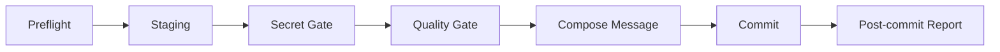

# git-commit skill 解析

`git-commit` 是一个把提交动作工程化的安全工作流。它的核心设计思想是：**提交是一道必须经过预检、分组、扫描、验证和留痕的质量闸口。** 因此它采用 7 步串行流程，而不是直接 `git add` + `git commit`。

## 1. 定义

`git-commit` 是一个安全增强型提交 skill。它会在真正执行提交之前，先验证仓库状态、识别暂存范围、扫描敏感信息、运行与生态匹配的质量门禁、生成符合 Angular / Conventional Commits 约束的英文提交说明，并在提交后输出结构化报告。

## 2. 背景与问题

这个 skill 要解决的问题是：团队把提交当成了一个过于随意的动作。

在没有约束时，常见问题通常集中在 5 类：

| 问题 | 典型后果 |
|------|----------|
| 仓库状态异常时仍然提交 | 把冲突、rebase 中间态、detached HEAD 一起提交进去 |
| 暂存范围失控 | 把不相关改动、临时文件、子模块指针一起带进 commit |
| 敏感信息未被发现 | API Key、私钥、数据库 URI 进入版本库 |
| 提交前不做质量验证 | 测试、lint、vet 没跑过，坏变更进入主干 |
| message 看似规范但语义失真 | scope 瞎编、subject 过长、一个 commit 混多个意图 |

`git-commit` 的设计逻辑，就是把这些高频失败点前移成强制门禁，并且让每一道门禁都有明确的输入、判断条件和失败出口。

## 3. 与常见替代方案的对比

在进入设计细节之前，先从整体上看 `git-commit` 与其他常见做法的差异，可以帮助建立一个直观的参照系：

| 维度 | `git-commit` skill | 直接 `git add && git commit` | 只做 commitlint / hook |
|------|--------------------|------------------------------|-------------------------|
| 仓库状态预检 | 强 | 弱 | 弱 |
| 暂存范围治理 | 强 | 弱 | 弱 |
| 密钥扫描 | 强 | 依赖人工 | 中 |
| 多生态质量门禁 | 强 | 常常缺失 | 中 |
| message 规范 | 强 | 不稳定 | 强 |
| 处理混合提交 | 强 | 弱 | 弱 |
| 提交后回执 | 强 | 弱 | 弱 |

它并不是要替代 hook，而是把 hook 之前那一层"智能化、结构化、面向用户交互的提交决策"补齐。

## 4. 核心设计逻辑

### 4.1 7 步串行流程

它的主流程是：

这个顺序不是随便排的，而是严格按"越便宜、越基础、越应该前置"的原则设计：

1. `Preflight` 先检查仓库是否处于可提交状态。
2. `Staging` 再确认"这次到底准备提交什么"。
3. `Secret Gate` 在代码质量检查之前先拦截高危内容。
4. `Quality Gate` 只对已经确定要提交的内容做验证。
5. `Compose Message` 放在最后生成，因为 message 必须建立在"已知提交范围、已知改动意图、已知检查结果"之上。
6. `Post-commit Report` 确保流程有始有终，避免提交完成后没有回执。

这套顺序解决了两个很实际的问题：

- 防止把时间浪费在错误对象上。比如仓库还在 rebase 中，就没必要先讨论 message。
- 防止后置修复。比如先提交、再发现密钥泄露，这时成本已经高很多。

### 4.2 把 Preflight 做成硬门禁

`git-commit` 在最开始就检查冲突、detached HEAD、rebase / merge / cherry-pick / revert 中间态。这背后的设计思想是：**很多提交事故不是代码内容错了，而是仓库上下文错了**。

这种检查的价值在于：

- 它们成本极低，只需几个确定性 Git 命令。
- 它们一旦失败，后续步骤全部失去意义。
- 它们能显著降低"把 Git 中间状态误当成正常工作树"的概率。

换句话说，Preflight 不是锦上添花，而是"提交资格验证"。

### 4.3 把 Staging 单独设计成一层

很多提交工具默认假设"用户已经正确暂存"。`git-commit` 没有接受这个假设，而是明确把暂存识别视为独立问题。

它在这里有 4 个重要设计：

| 设计 | 设计原因 |
|------|----------|
| `> 8` 个变更文件时强制列全量文件并请求确认 | 文件一多就容易忽略细节，误提的概率随之上升 |
| 按逻辑意图分组，而不是按文件列表机械提交 | 一个好的 commit 单位是"一个变更意图"，不是"一组文件" |
| 单文件存在多个意图时允许 `git add -p` | 防止"文件级提交粒度过粗" |
| 对未暂存改动先 `stash --keep-index` 再做质量门禁 | 确保质量门禁验证的是即将提交的内容，同时不丢用户本地工作 |

**关于"8 文件"阈值**：这个数字并非随意选取。认知科学对人类工作记忆容量的研究表明，人在同时处理的对象超过 7±2 个时，出错概率会显著上升（Miller's Law）。超过 8 个变更文件的暂存集，人工逐一核对意图的可靠性已经大幅下降。选择 8 而不是"看起来很多"作为阈值，是为了给行为定一个清晰的触发点，让这道确认变成一个**可预期的安全网**，而不是模型凭感觉决定要不要问。

这里最亮的点是 `stash --keep-index`。它体现的是很成熟的工程判断：**提交前的测试应该针对即将提交的内容，而不是还夹杂着未暂存改动的工作区状态**。

### 4.4 敏感信息扫描采用"正则 + 分层 Triage"

仅靠人工看 diff，很容易漏掉 token、私钥和连接串。仅靠宽泛正则，又会产生大量误报。`git-commit` 在这里的设计不是二选一，而是两者结合：

1. 先用文件名和内容正则尽量多地捕获可疑内容。
2. 再按白名单、测试数据文件、文档、注释四类规则逐层过滤。
3. 只有经过过滤仍然存活的命中，才真正阻断提交。

这套设计解决的是"安全性"和"可用性"的平衡：

- 只有扫描，没有 Triage，用户会被误报拖垮。
- 只有人工判断，没有扫描，真正高危内容容易漏掉。

而且它把过滤顺序固定为"first hit decides"，结果稳定，不会因模型对具体情况的临时判断而出现差异。

### 4.5 质量门禁按生态拆到 references

`git-commit` 没把 Go、Node、Python、Java、Rust 的质量检查全塞进主文件，而是把它们拆进独立的 `references/quality-gate-*.md`。

这是一个很关键的设计取舍，原因有三点：

| 取舍目标 | 这样设计的好处 |
|----------|----------------|
| 控制主 skill 体积 | 主文件保持聚焦，只讲通用提交流程 |
| 按需加载 | 当前仓库是什么生态，就只读对应 gate |
| 提高可维护性 | 各语言门禁可以独立迭代，不会牵动主流程 |

更重要的是，它并没有把"怎么判断该跑哪个 gate"交给模型自由发挥，而是给出确定性规则：先看 staged 文件扩展名数量，再结合 marker file 和距离仓库根的优先级做选择。这个设计重点不是"聪明"，而是"可复现"。

### 4.6 message 生成被严格约束

这个 skill 对提交说明的约束非常硬，尤其是两条：

- subject 总长度必须小于等于 `50` 字符。
- scope 只有在历史里已经形成规范时才允许使用，否则直接省略。

这两条设计分别解决两个常见问题：

| 约束 | 解决的问题 |
|------|------------|
| `<= 50` 字符 | 防止 subject 变成"摘要里再塞一篇小作文" |
| 禁止凭空发明 scope | 防止 message 看起来专业，实际上在制造错误分类 |

"不要发明 scope"这一点尤其重要。很多工具会鼓励模型总是补一个 scope，但 `git-commit` 明确要求先用历史 commit 频率做发现，再决定是否使用。这种设计本质上是在反对虚假的结构化输出。

2026-04 的修订又把这条规则补强了两处：

- **只在新仓库里做 bootstrap scope**：如果仓库里的 conventional commits 总数少于 10，则允许在剥离 `src`、`pkg`、`internal`、`service`、`services`、`module`、`package`、`component`、`testdata` 等泛化目录后，从 staged 文件的最深稳定共享目录推断 scope。这样修复了"新仓库永远建不出 scope"的问题，同时又不会在成熟仓库里随意发明新 scope。
- **把 50 字符限制变成可执行 guard**：skill 现在要求在 `git commit` 前先执行 shell 层的长度校验和结尾句号校验。这样 subject 上限不再只依赖模型自觉，而是有明确的命令级防线。

### 4.6.1 Timeout Override 需要显式机制

原始的 120 秒超时规则是保守的，但对大型 Java 或多模块构建过于僵硬。现在 skill 把 timeout 定义成"有默认值 + 可覆盖链"的确定性配置：

- 默认值：无输出 120 秒。
- 覆盖来源：仓库 wrapper 配置（`COMMIT_TEST_TIMEOUT`）或环境变量（`QUALITY_GATE_TIMEOUT_SECONDS`、`SKILL_QUALITY_GATE_TIMEOUT_SECONDS`）。
- 操作规则：在长时间质量门禁开始前，先报告最终采用的 timeout。

这样既保留了"不能无限挂起"的安全属性，也去掉了"构建慢但健康，却被误判为失败"的假阳性问题。

### 4.7 提交后还要有报告

很多流程把 `git commit` 成功当成结束，`git-commit` 没这么做。它要求提交后输出短 hash、最终 subject、变更文件摘要和 gate 状态。

这个设计补上了三个价值：

- 让用户立刻确认"刚才到底提交了什么"。
- 让质量门禁结果有回执，而不是只在过程里一闪而过。
- 为后续 PR、审查、回溯提供统一输入。

所以它不是只关心"执行 commit"，而是关心"整个提交流程有没有完整收尾"。

### 4.8 hook 被拒绝后禁止使用 `--no-verify`

`git-commit` 在 Step 6 有一条明确规定：如果提交被 Git hook（commitlint、pre-commit、husky、lefthook 等）拒绝，必须读取报错、调整 message 以满足 hook，而不是用 `--no-verify` 绕过，除非用户明确要求。

这条规则背后的设计逻辑是：**hook 是团队合规层，不是个人工作流里可以自行绕过的噪音**。

- 项目里的 hook 通常是团队或组织明确写下来的规范——scope 白名单、ticket ID 格式要求、禁止 WIP 类型等。用 `--no-verify` 绕过，等于单方面声明自己的提交凌驾于团队规范之上。
- hook 拒绝本身就是信息：它告诉你 message 不符合规范，正确响应是修改 message，而不是消除这个反馈。
- 允许 AI 工具默认 `--no-verify` 会形成恶性循环：团队花精力配置了合规 hook，AI 工具把它们静默绕过了。

`git-commit` 的处理方式是：报告 hook 名称和具体报错，根据报错调整 message，并记录做了哪些调整。这样既解决了问题，又保留了 hook 完整的约束效力。唯一的例外是用户明确指示跳过——此时记录"quality gate: skipped by user"，把决策责任还给用户，而不是由工具替用户做这个决定。

## 5. 这个设计解决了哪些具体问题

从 `SKILL.md` 的规则和评估报告可以看出，它重点解决的是以下几类工程问题：

| 问题类型 | skill 中的对应设计 | 实际效果 |
|----------|-------------------|----------|
| Git 状态误判 | Preflight 硬门禁 | 在冲突、rebase、detached HEAD 等场景先停下 |
| 提交范围失控 | 分组暂存、`> 8` 文件阈值、`git add -p` | 减少混合提交和误提文件 |
| 敏感信息泄露 | 文件名扫描 + 内容扫描 + Triage | 提高发现率，同时降低误报 |
| 质量检查缺失 | 生态感知 quality gate | 提交前尽量保证最基本的 lint / test / vet 已执行 |
| message 失真 | 历史 scope 发现、长度限制、祈使语气 | 提高提交历史的一致性和可读性 |
| 绕过团队规范 | 拒绝默认 `--no-verify`，要求根据报错调整 | 保持 hook 合规层的完整约束力 |
| 流程不可审计 | Post-commit report | 给提交动作留下结构化回执 |

评估报告里的数据也支持这一点：`git-commit` 在 3 个测试场景、35 项断言中达到 `100%` 通过，而不用该 skill 的常规做法严格通过率只有 `23%`。2026-04 新增的回归层又补了 7 个 golden fixtures，覆盖 message 生成、scope bootstrap 和 timeout override 行为。这说明它的价值并不只是在"格式更好看"，而是在真实工作流里显著减少遗漏步骤。

## 6. 主要亮点

### 6.1 把"提交"从命令动作升级为质量闸口

这是整个 skill 最重要的亮点。它不再把 commit 看成一个机械命令，而是把它定义为代码进入历史之前的最后一道本地关卡。

### 6.2 强调确定性，而不是依赖模型临场发挥

这个 skill 里大量关键决策都不是"让模型猜"，而是"先跑命令，再按规则判断"，例如：

- 用 Git 命令识别仓库状态。
- 用 staged diff 而不是工作区猜测提交内容。
- 用扩展名和 marker file 选择 quality gate。
- 用历史 commit 频率决定 scope 能不能出现。

这说明它的设计目标不是让模型"显得聪明"，而是让流程"足够稳定"。

### 6.3 安全严格，同时不给日常开发增加不必要的负担

如果一个 skill 只有严格，没有降误报设计，用户最终会绕开它。`git-commit` 在这方面做得比较平衡：

- 敏感信息扫描提供 allowlist 和 Triage，而不是一刀切。
- 多生态门禁按需选择，不要求每个项目都跑一套大而全检查。
- 当用户明确要求跳过 gate 时，允许跳过，但必须记录状态。

这让它既能守住底线，又不至于变成"谁都不想用"的流程负担。

### 6.4 对边角情况做显式规定，而不是依赖默认行为

`git-commit` 对若干容易出事故的边角情况做了明确规定，例如：

- 空提交只能在用户明确要求时使用。
- submodule 指针变更必须再次确认。
- hook 拒绝后要根据报错调整，而不是直接 `--no-verify`。
- 超过 `120` 秒无输出的质量门禁要中断并反馈。

这类规则的价值在于，覆盖的不是一切顺利的正常路径，而是工程中最容易被忽略的异常情况。

## 7. 什么时候适合用，什么时候不该硬用

| 场景 | 是否适合 | 原因 |
|------|----------|------|
| 日常开发提交 | 适合 | 最能发挥预检、分组、质量门禁的价值 |
| 团队想统一 commit 质量 | 适合 | 能把隐性规范转成可执行流程 |
| 多语言仓库 | 适合 | 有生态感知 gate，不必手工切换 |
| 为了赶时间想一次塞很多不相关改动 | 不适合 | 它会主动阻止这种做法 |
| 明知要跳过所有检查只求快速留点 | 不适合 | 这和 skill 的设计目标相反 |

## 8. 结论

`git-commit` 的真正亮点，不是它会写 Conventional Commit，而是它把"提交前该做的判断"系统化了。它通过 7 步串行流程，把仓库状态检查、变更边界控制、敏感信息防护、生态质量门禁、消息规范化和结果回执串成一个完整闭环。

从设计上看，这个 skill 非常典型地体现了生产级 skill 的几个原则：**先建门禁、再生成内容；先收集依据、再组织语言；先管控风险、再追求流畅**。这也是它为什么能解决"提交动作太轻、风险太重"的根本问题。

## 9. 文档维护

当以下内容发生变化时，这份文档应该同步更新：

- `skills/git-commit/SKILL.md` 的工作流、硬规则或失败处理逻辑发生变化。
- `skills/git-commit/references/quality-gate-*.md` 的门禁策略发生变化。
- `evaluate/git-commit-skill-eval-report.zh-CN.md` 中用于支撑本文结论的关键数据发生变化。
- 项目对 Conventional Commits、scope 使用或提交流程的团队约束发生变化。

建议按季度复查一次；如果 `git-commit` skill 有较大重构，则应立即复查。

## 10. 相关阅读

- `skills/git-commit/SKILL.md`
- `skills/git-commit/references/quality-gate-go.md`
- `skills/git-commit/references/quality-gate-node.md`
- `skills/git-commit/references/quality-gate-python.md`
- `skills/git-commit/references/quality-gate-java.md`
- `skills/git-commit/references/quality-gate-rust.md`
- `evaluate/git-commit-skill-eval-report.zh-CN.md`
