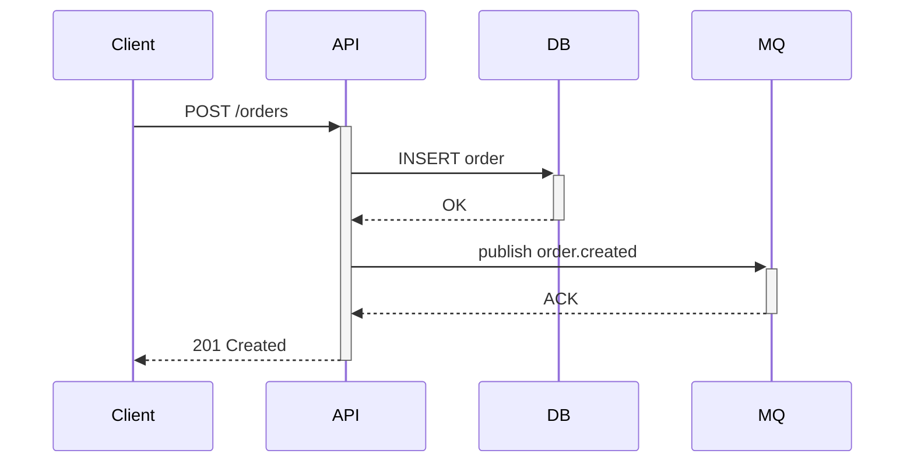

# Writing Quality Guide

This reference contains concrete BAD/GOOD examples, anti-patterns, and detailed writing techniques. Load specific sections as directed by SKILL.md's "Load References Selectively."

## Table of Contents

1. [§Funnel Structure — Mixed Audience Layering](#funnel-structure--mixed-audience-layering)
2. [§BAD/GOOD Examples](#badgood-examples)
3. [§Code Examples](#code-examples)
4. [§Visual Expression](#visual-expression)
5. [§Review Patterns](#review-patterns)

---

## §Funnel Structure — Mixed Audience Layering

When readers span multiple roles (Leader + Dev + QA + Ops), use layered depth:

```
┌─────────────────────────────────┐
│  Executive Summary (1段)         │  ← Everyone reads
│  Core conclusion + trade-offs   │
├─────────────────────────────────┤
│  Overview (1-2 pages)           │  ← Leader + senior dev
│  Architecture + comparison      │
├─────────────────────────────────┤
│  Technical Detail               │  ← Implementers
│  API + data model + edge cases  │
├─────────────────────────────────┤
│  Appendix                       │  ← Quick reference
│  Config + error codes + logs    │
└─────────────────────────────────┘
```

**Rules**:
- Each layer must be independently readable — a reader who stops after the Overview should still get a complete picture at that depth level.
- Link downward: "See §5 for implementation details" — never force readers to read sequentially.
- The Executive Summary is the most important paragraph. If the reader only reads one thing, they should get the core conclusion, key risk, and recommended action.

---

## §BAD/GOOD Examples

### Conclusion Buried vs. Conclusion First

**BAD** — conclusion at the end:
> We investigated the outage. The monitoring dashboard showed memory rising. Heap dumps
> revealed a goroutine leak in the WebSocket handler. The ticker was not stopped on
> connection close. Root cause: goroutine leak due to un-stopped ticker.

**GOOD** — conclusion first:
> **Root cause: goroutine leak due to un-stopped ticker in the WebSocket handler.**
> The monitoring dashboard showed memory rising steadily. Heap dumps confirmed goroutine
> count grew linearly with connections. The ticker created per-connection was never stopped
> on `Close()`.

The second version lets the reader decide in 1 second whether to keep reading.

---

### Wall of Text vs. Structured

**BAD** — information tangled:
> To deploy the service, you need to have Docker installed and access to the registry.
> You should also make sure the config file exists. Run the deploy command and then check
> if the pods are healthy. If something goes wrong you can rollback. The config should
> have the correct database URL and Redis address. Make sure you're on VPN.

**GOOD** — structured and actionable:
> **Prerequisites**
> - Docker installed (v24+)
> - VPN connected
> - Registry access: `docker login registry.internal.com`
> - Config file at `./deploy/config.yaml` (must contain `db_url` and `redis_addr`)
>
> **Steps**
> 1. Deploy: `make deploy ENV=prod`
>    - Expected: `deployment/myservice: 3/3 pods ready`
> 2. Verify: `curl -s https://myservice.internal/health | jq .status`
>    - Expected: `"ok"`
>
> **Rollback**: `make rollback ENV=prod VERSION=<previous>`

---

### Ambiguous Subject / Terminology Mixing

**BAD** — missing subject, synonym mixing:
> Error: 视频数据包不完整，主要发生在上下麦瞬间，packet不完整会引起花屏。

| Problem | Type |
|---------|------|
| "主要发生" lacks subject | Ambiguous writing |
| "上下麦" — who? | Missing context for new concept |
| "packet" vs "数据包" | Synonym mixing |
| "引起花屏" — where? | Missing context |

**GOOD** — explicit subject, consistent term:
> Error: 视频数据包不完整，**该错误**主要发生在**主播端**上下麦的瞬间。**数据包**不完整会造成**接收端**出现花屏。

---

### Verbose vs. Concise

| BAD (verbose) | GOOD (concise) |
|---------------|----------------|
| 我们需要做的是先去检查一下配置文件 | 检查配置文件 |
| 在这种情况下我们可以考虑使用 Redis | 此场景适合使用 Redis |
| 关于这个问题我们的建议是重启服务 | 建议：重启服务 |

Filler words to delete: "其实", "然后呢", "就是说", "我们需要做的是", "可以考虑".

---

### Generic Title vs. SPA Title

| BAD | GOOD | Why |
|-----|------|-----|
| Notes | Connection Pool Internals | Specific, searchable |
| Documentation | Deploy Redis Cluster | Action + object, reader gains |
| Guide | MySQL: Deadlock Under High Concurrency | Problem-specific, hits keywords |
| README | RFC-042: Migrate to Event-Driven Architecture | Numbered, clear scope |

---

## §Code Examples

### Runnable vs. Snippet: When to Use Which

| Type | Characteristics | Use When |
|------|----------------|----------|
| Runnable example | Includes imports + main, copy-paste-run | Quickstart, task docs, API first-use |
| Key snippet | Core logic only, omits boilerplate | Concept docs, comparisons, performance |

**Rule**: Task doc commands and code MUST be copy-paste-runnable. Concept doc snippets MUST be marked "simplified example".

### Quality Bar for Code Examples

1. **Self-contained**: reader doesn't guess missing imports or variables.
2. **Comments explain WHY**, not what the code does.
3. **Show expected output** right after the code block.
4. **Cover failure path**: not just happy path — show error handling.

### GOOD — Self-contained, with output, with error handling:

```go
package main

import (
    "fmt"
    "io"
    "log"
    "net/http"
)

func main() {
    resp, err := http.Get("https://api.example.com/users/1")
    if err != nil {
        log.Fatalf("请求失败: %v", err)
    }
    defer resp.Body.Close()

    if resp.StatusCode != http.StatusOK {
        log.Fatalf("非预期状态码: %d", resp.StatusCode)
    }

    body, err := io.ReadAll(resp.Body)
    if err != nil {
        log.Fatalf("读取响应失败: %v", err)
    }
    fmt.Println(string(body))
}
// Expected output: {"id":1,"name":"alice","email":"alice@example.com"}
```

### BAD — Fragment without context:

```go
body, _ := io.ReadAll(resp.Body)
fmt.Println(string(body))
```

Problems: no imports, ignores error, no expected output, no error handling, reader cannot run it.

### Keeping Code Examples Alive

Code examples rot faster than prose. Prevention strategies:
- **CI verification**: extract key examples into `_example_test.go`, run in `go test` pipeline.
- **Version anchoring**: pin dependency versions to `go.mod`; update examples when upgrading.
- **Change linkage**: PR template must include "Does this change affect code examples in docs?"

---

## §Visual Expression

### When to Use Diagrams

| Scenario | Use Diagram | Use Text |
|----------|------------|----------|
| 3+ component interactions | ✓ | |
| State transitions with branches | ✓ | |
| Sequential interactions (A→B→A) | ✓ | |
| Causal reasoning and arguments | | ✓ |
| Single linear sequence | | ✓ |

### Preferred Diagram Tools (Git-Friendly)

| Tool | Strength | Use For |
|------|----------|---------|
| Mermaid | GitHub/GitLab native render | Flowcharts, sequence, class |
| PlantUML | Rich syntax, needs plugin | Complex sequence, component |
| ASCII art | Lightest, no tools needed | Inline architecture sketch |

### Diagram Quality Rules

Every diagram must have:
1. **Title** explaining what the diagram shows.
2. **Legend** for non-obvious symbols, colors, or line styles.
3. **Consistent naming** with prose — if the text says "Order Service", the diagram must not say "OrderSvc".

### Diagram Complexity Control

- **Node limit**: ≤ 15 nodes per Mermaid diagram. Beyond this, rendering failures increase and readability drops.
- **Split strategy**: If the full picture exceeds 15 nodes, decompose into:
  1. A high-level overview diagram (5–8 nodes, system boundaries only)
  2. Detail sub-diagrams per subsystem (≤ 15 nodes each)
  3. Cross-reference between diagrams: "See §Detail: Payment Flow below"
- **Test rendering**: After writing a Mermaid block, mentally count nodes. If > 15, split before delivering.

### Mermaid Example



Binary images (PNG/SVG) go in `images/` subdirectory; reference via relative paths.

---

## §Review Patterns

When reviewing an existing document:

1. **Read the full document first.** Do not start commenting before understanding the whole.
2. Classify its type using the Gate 2 table.
3. Run the Quality Scorecard from SKILL.md against it.
4. Group findings by severity:
   - **Critical**: reader cannot complete the task (missing steps, wrong commands, no verification)
   - **Major**: reader will be confused or misled (inconsistent terms, missing prerequisites, no error handling)
   - **Minor**: polish items (formatting, redundant text, missing signposts)
5. For every finding, provide a concrete **before/after fix**, not a vague suggestion.
6. Acknowledge what works well — review is not just about finding faults.

### Common Review Pitfalls to Watch For

| Pitfall | What to Flag |
|---------|-------------|
| Commands that reference non-existent paths | Verify paths exist or mark as UNVERIFIED |
| Version numbers without `applicable_versions` metadata | Reader won't know if this applies to them |
| "See other doc" without an actual link | Either add the link or remove the reference |
| Steps that assume unstated permissions | Add to Prerequisites |
| Mixed language (Chinese/English) for the same term | Pick one, use it consistently |

---

## §Anti-Examples

Common technical documentation mistakes to avoid. Load this section in Review or Improve mode.

1. **Conclusion buried at end** — "We investigated... Finally, root cause was X." Always lead with the conclusion.
2. **Wall of text** — Unstructured paragraphs mixing prerequisites, steps, and troubleshooting. Structure into sections.
3. **"Just restart the service"** — No risk assessment, no rollback plan, no verification step. Every action needs context.
4. **"Might be a network issue"** — Diagnosis without evidence. Every claim needs logs, metrics, or traces.
5. **Synonym mixing** — Alternating "数据包" and "packet", "集群" and "cluster" in the same doc.
6. **Missing subject** — "主要发生在上下麦瞬间" — who/what is the subject? Ambiguous writing.
7. **Happy-path-only code** — Code example showing only success with no error handling.
8. **"Click here" links** — Links without describing the target content. State what the reader will find.
9. **Generic titles** — "Notes", "Documentation", "Guide". Use SPA titles that hit search keywords.
10. **Orphaned doc** — No owner, no last_updated, no applicable_versions. Guaranteed to rot.
11. **Copy-paste from chat** — Pasting Slack/IM conversations as documentation. Restructure into proper format.
12. **"See other doc" without link** — References to documents that aren't linked or don't exist.
